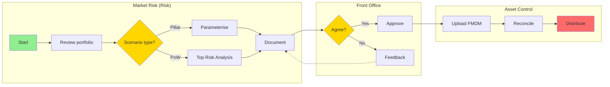
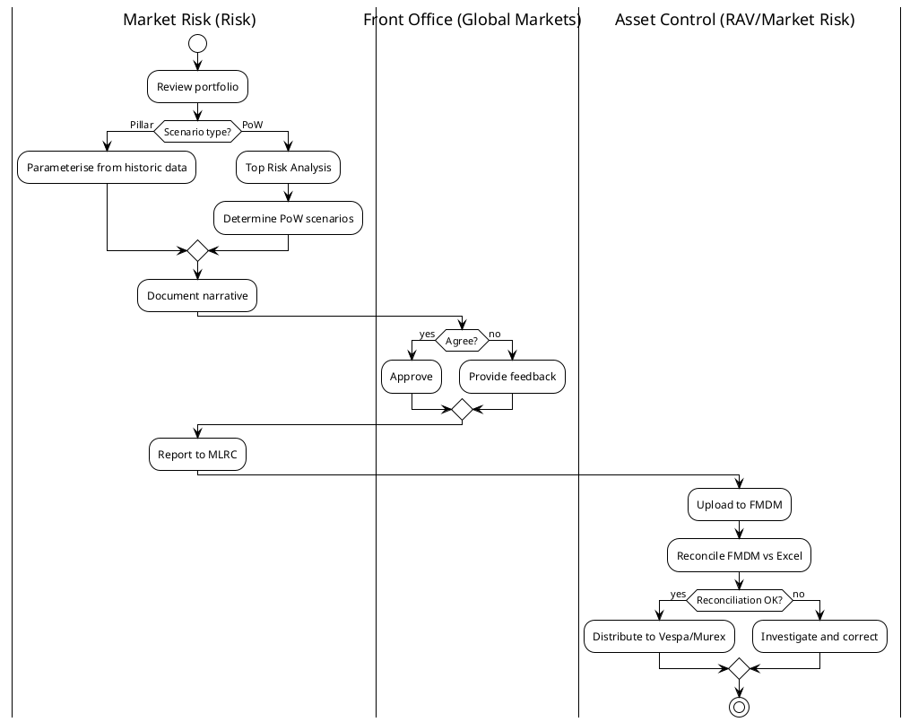
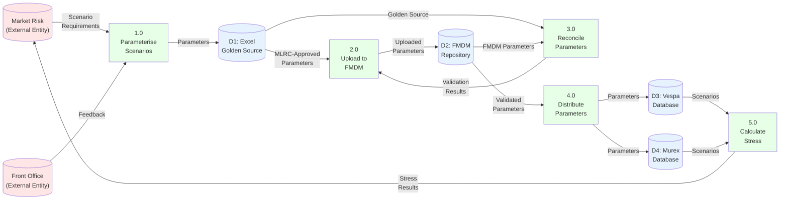

# Process Documenter - Reference Guide

## Table of Contents
1. [Diagram Format Selection](#diagram-format-selection)
2. [BPMN 2.0 Guide](#bpmn-20-guide)
3. [Mermaid Guide](#mermaid-guide)
4. [PlantUML Guide](#plantuml-guide)
5. [Data Flow Diagram Guide](#data-flow-diagram-guide)
6. [Best Practices](#best-practices)
7. [Common Pitfalls](#common-pitfalls)

---

## Diagram Format Selection

### Decision Matrix

| Criteria | BPMN 2.0 | Mermaid LR | PlantUML | DFD |
|----------|----------|------------|----------|-----|
| **Swim lanes** | ✅ Horizontal | ⚠️ Limited | ⚠️ Vertical only | ❌ N/A |
| **Formal governance** | ✅ Yes | ❌ No | ⚠️ Moderate | ❌ No |
| **Version control** | ⚠️ XML | ✅ Text | ✅ Text | ✅ Text |
| **GitHub rendering** | ❌ No | ✅ Yes | ✅ Yes | ✅ Yes (as Mermaid) |
| **Tool support** | ✅ Many | ⚠️ Limited | ⚠️ Limited | ⚠️ Limited |
| **Message flows** | ✅ Yes | ❌ No | ❌ No | ✅ Yes (as data flows) |
| **Sub-processes** | ✅ Yes | ❌ No | ⚠️ Limited | ❌ N/A |
| **System interactions** | ⚠️ Possible | ❌ No | ❌ No | ✅ Yes |
| **Complexity handling** | ✅ Excellent | ⚠️ Moderate | ⚠️ Moderate | ⚠️ Moderate |

### Recommendation Logic

```python
def recommend_format(characteristics):
    swim_lanes = characteristics['swim_lanes']
    has_systems = characteristics['has_systems']
    formal = characteristics['formal_governance']
    complex = characteristics['complexity'] in ['high', 'very_high']

    if formal and swim_lanes >= 2:
        return 'BPMN 2.0'  # PRIMARY

    if has_systems and characteristics['focus'] == 'data_flow':
        return 'Data Flow Diagram'  # PRIMARY for system interactions

    if swim_lanes <= 2 and not complex:
        return 'Mermaid LR'  # SECONDARY - good for simple processes

    return 'BPMN 2.0'  # DEFAULT for most business processes
```

### When to Use Each Format

#### BPMN 2.0 ✅
**Use when:**
- 2+ departments involved (swim lanes needed)
- Formal governance process (MLRC, Board approval)
- Banking/regulatory process
- Complex process with sub-processes
- Message flows between departments
- Need industry-standard notation

**Examples:**
- Stress testing parameterisation
- Loan approval workflows
- Regulatory reporting processes
- Committee governance processes

#### Mermaid LR ⚠️
**Use when:**
- Simple process (1-2 swim lanes)
- Need GitHub rendering
- Iterative development (version control important)
- Internal documentation
- Quick diagrams

**Examples:**
- Internal team workflows
- Simple approval chains
- Documentation for developers

#### PlantUML ⚠️
**Use when:**
- Vertical flow preferred
- Technical audience
- Decision trees
- State machines

**Examples:**
- System state transitions
- Decision logic diagrams
- Technical specifications

#### Data Flow Diagram ✅
**Use when:**
- Focus on system interactions
- Data transformations important
- Multiple systems involved
- Need to show data stores

**Examples:**
- FMDM → Vespa → Murex data flow
- ETL process documentation
- System integration architecture

---

## BPMN 2.0 Guide

### Key Elements

#### 1. Pools & Swim Lanes
```xml
<bpmn:collaboration id="Collaboration_1">
  <bpmn:participant id="Participant_MR" name="Market Risk (Risk)" processRef="Process_MR" />
  <bpmn:participant id="Participant_FO" name="Front Office" processRef="Process_FO" />
</bpmn:collaboration>
```

**Use:**
- One pool = one organization/entity
- One swim lane (participant) = one department/role
- Horizontal lanes for cross-functional processes

#### 2. Tasks
```xml
<bpmn:task id="Task_1" name="Review scenario and store in FMDM" />
<bpmn:userTask id="Task_2" name="Approve parameters" />
<bpmn:serviceTask id="Task_3" name="Calculate stress results" />
```

**Types:**
- `task`: Generic activity
- `userTask`: Human interaction
- `serviceTask`: Automated system task
- `sendTask`: Sends message
- `receiveTask`: Waits for message

#### 3. Gateways (Decision Points)
```xml
<bpmn:exclusiveGateway id="Gateway_1" name="Reconciliation OK?" />
```

**Types:**
- `exclusiveGateway`: One path (XOR) - use for Yes/No, Pass/Fail
- `parallelGateway`: All paths (AND) - use for parallel activities
- `inclusiveGateway`: One or more paths (OR)

#### 4. Events
```xml
<bpmn:startEvent id="Start_1" name="Start" />
<bpmn:endEvent id="End_1" name="Complete" />
<bpmn:intermediateThrowEvent id="Event_1" name="Send notification" />
```

**Types:**
- `startEvent`: Start of process
- `endEvent`: End of process
- `intermediateCatchEvent`: Wait for something
- `intermediateThrowEvent`: Trigger something

#### 5. Sequence Flows
```xml
<bpmn:sequenceFlow id="Flow_1" sourceRef="Task_1" targetRef="Gateway_1" />
<bpmn:sequenceFlow id="Flow_2" sourceRef="Gateway_1" targetRef="Task_2" name="Yes" />
```

**Use:** Connect elements within a swim lane

#### 6. Message Flows
```xml
<bpmn:messageFlow id="Flow_MR_to_FO" sourceRef="Task_Consult" targetRef="Participant_FO" />
```

**Use:** Show communication between swim lanes (dashed lines)

#### 7. Sub-Processes
```xml
<bpmn:subProcess id="SubProc_1" name="Top Risk Analysis">
  <bpmn:startEvent id="Start_Sub" />
  <bpmn:task id="Task_Sub1" name="Identify risks" />
  <bpmn:task id="Task_Sub2" name="Rank risks" />
  <bpmn:endEvent id="End_Sub" />
  <bpmn:sequenceFlow sourceRef="Start_Sub" targetRef="Task_Sub1" />
  <bpmn:sequenceFlow sourceRef="Task_Sub1" targetRef="Task_Sub2" />
  <bpmn:sequenceFlow sourceRef="Task_Sub2" targetRef="End_Sub" />
</bpmn:subProcess>
```

**Use:** Model complex activities that have their own flow

**Collapsed:**
```xml
<bpmn:task id="Task_Collapsed" name="Top Risk Analysis" />
```
Shows as single box, details hidden (can link to separate diagram)

### BPMN Diagram Interchange (Visual Layout)

**Critical**: BPMN needs DI (Diagram Interchange) to render visually.

```xml
<bpmndi:BPMNDiagram id="Diagram_1">
  <bpmndi:BPMNPlane bpmnElement="Collaboration_1">

    <!-- Swim lane shape -->
    <bpmndi:BPMNShape id="Participant_MR_di" bpmnElement="Participant_MR" isHorizontal="true">
      <dc:Bounds x="160" y="80" width="1400" height="250" />
    </bpmndi:BPMNShape>

    <!-- Task shape -->
    <bpmndi:BPMNShape id="Task_1_di" bpmnElement="Task_1">
      <dc:Bounds x="290" y="138" width="100" height="80" />
    </bpmndi:BPMNShape>

    <!-- Edge (connection) -->
    <bpmndi:BPMNEdge id="Flow_1_di" bpmnElement="Flow_1">
      <di:waypoint x="390" y="178" />
      <di:waypoint x="425" y="178" />
    </bpmndi:BPMNEdge>

  </bpmndi:BPMNPlane>
</bpmndi:BPMNDiagram>
```

**Layout Tips:**
- Swim lanes: 200-300px height, 1200-1600px width
- Tasks: 100-120px width, 60-80px height
- Gateways: 50x50px diamond
- Events: 36x36px circle
- Spacing: 30-50px between elements

---

## Mermaid Guide

### Mermaid Left-to-Right (LR) for Swim Lanes



**Key Points:**
- `graph LR`: Left-to-right direction
- `subgraph`: Creates swim lanes (but not true horizontal lanes)
- `direction LR`: Forces left-to-right within subgraph
- `{...}`: Decision point (diamond)
- `[...]`: Task (rectangle)
- `-.->`: Dotted line (feedback, optional)
- `-->`: Solid arrow (sequence)
- `style`: Customize colors

**Limitations:**
- Swim lanes are stacked vertically, not horizontal
- No message flows between lanes
- Limited to basic elements

---

## PlantUML Guide

### PlantUML Activity Diagram with Swim Lanes



**Key Points:**
- `|Department|`: Switch swim lanes
- `:Activity;`: Task (colon prefix)
- `if...then...else...endif`: Decision
- `start` / `stop`: Start/end events
- Swim lanes are **vertical only**

**Limitations:**
- No horizontal swim lanes
- Message flows limited
- Feedback loops can be tricky

---

## Data Flow Diagram Guide

### Mermaid Flowchart for DFD



**DFD Elements:**
- **External Entities**: Circles or rectangles (sources/sinks outside system)
- **Processes**: Rounded rectangles with numbers (1.0, 2.0)
- **Data Stores**: Cylinders or open rectangles (D1, D2)
- **Data Flows**: Arrows with labels (what data moves)

**Levels:**
- **Context Diagram (Level 0)**: High-level, one process
- **Level 1**: Major processes
- **Level 2**: Detailed sub-processes

---

## Best Practices

### 1. Naming Conventions

**Tasks:**
- Use verb + object: "Review scenario", "Upload parameters", "Reconcile FMDM"
- Be specific: Not "Process data", but "Reconcile FMDM vs Excel golden source"
- Keep concise: 3-7 words

**Decision Points:**
- Use questions: "Reconciliation OK?", "Scenario type?", "Agree with scenario?"
- Make binary clear: Yes/No, Pass/Fail, Option A/Option B

**Swim Lanes:**
- Use full department name: "Market Risk (Risk)", not "MR"
- Include clarification if needed: "Asset Control (RAV/Market Risk)"
- Distinguish from systems: "Asset Control" (dept) vs "FMDM" (system)

### 2. Sequence & Critical Controls

**Always validate:**
- Critical controls happen in the right sequence
- Reconciliation BEFORE distribution, not after
- Approvals BEFORE execution, not after
- Quality checks at the right points

**Example - WRONG:**
```
Upload to FMDM → Distribute to Vespa/Murex → Reconcile FMDM vs Excel
```

**Example - CORRECT:**
```
Upload to FMDM → Reconcile FMDM vs Excel → If OK: Distribute to Vespa/Murex
```

### 3. Department vs System Distinction

**Always clarify:**
- "Asset Control" = department
- "FMDM" = system (Financial Market Data Management)

**In diagrams:**
- Swim lanes = departments (Asset Control)
- Tasks may reference systems (Upload to FMDM, Send to Vespa)

### 4. Sub-Processes

**When to use:**
- Activity is complex (4+ sub-steps)
- Activity is reusable (happens in multiple processes)
- Detail would clutter main diagram

**Options:**
- **Collapsed**: Show as single box, link to separate diagram
- **Expanded**: Show sub-steps within main diagram (use sparingly)

**Example:**
- "Top Risk Analysis" could be collapsed in main diagram
- Separate diagram shows: Identify risks → Rank by severity → Select top 3-5 → Determine scenarios

### 5. Message Flows (BPMN)

**Use for:**
- Cross-department communication
- Document handoffs
- Approvals
- Notifications

**Example:**
```
Market Risk → Front Office: Send parameters for consultation
Front Office → Market Risk: Feedback and approval
Market Risk → Asset Control: MLRC-approved parameters
```

### 6. Looping & Iteration

**Use for:**
- Rework loops (if approval fails, revise and resubmit)
- Iteration (consult until agreed)
- Error recovery (if reconciliation fails, correct and retry)

**BPMN:** Use sequence flow back to earlier step
**Mermaid:** Use dotted line `-.->` for feedback
**PlantUML:** Use `repeat...repeat while` or backward arrows

### 7. Documentation Completeness

**Always include:**
- Process overview
- Trigger events
- Detailed step descriptions
- Decision point criteria
- Swim lane responsibilities
- Inputs and outputs
- Timing and frequency
- Critical controls
- Exception handling

---

## Common Pitfalls

### ❌ Pitfall 1: Wrong Sequence for Critical Controls

**Problem:**
```
Upload to system → Execute action → Validate
```

**Solution:**
```
Upload to system → Validate → If OK: Execute action
```

**Lesson:** Quality gates must come BEFORE execution, not after

---

### ❌ Pitfall 2: Confusing Departments and Systems

**Problem:**
```
Swim Lane: "FMDM"
Task: "Asset Control uploads parameters"
```

**Solution:**
```
Swim Lane: "Asset Control (RAV/Market Risk)"
Task: "Upload parameters to FMDM"
```

**Lesson:** Swim lanes = organizational units, not systems

---

###  Pitfall 3: Missing Message Flows

**Problem:** BPMN diagram with multiple swim lanes but no message flows (just sequence flows crossing lanes)

**Solution:** Use `<bpmn:messageFlow>` for cross-lane communication

---

### ❌ Pitfall 4: Overly Complex Diagrams

**Problem:** 50+ boxes in one diagram, unreadable

**Solution:** Use sub-processes or create multiple diagrams (Level 1, Level 2)

**Rule of thumb:** 15-25 boxes per diagram max

---

### ❌ Pitfall 5: Ambiguous Decision Points

**Problem:**
```
Decision: "Check parameters?"
Yes → ?
No → ?
```

**Solution:**
```
Decision: "Reconciliation OK? (FMDM vs Excel golden source)"
Yes → Distribute to Vespa/Murex
No → Investigate discrepancies, correct FMDM, re-reconcile
```

**Lesson:** Be specific about what's being decided and what happens in each path

---

### ❌ Pitfall 6: Missing Exception Handling

**Problem:** No error paths, only "happy path"

**Solution:** Add exception flows:
- What if approval is denied?
- What if reconciliation fails?
- What if system error occurs?

---

### ❌ Pitfall 7: Inconsistent Naming

**Problem:**
- Step 1: "Review scenario"
- Step 5: "Scenario review"
- Step 10: "Reviewing scenarios"

**Solution:** Use consistent naming:
- All tasks: Verb + object ("Review scenario", "Upload parameters")
- All decisions: Questions ("Reconciliation OK?", "Agree with scenario?")

---

## Quick Reference

### BPMN Elements

| Element | XML Tag | Use Case |
|---------|---------|----------|
| Task | `<bpmn:task>` | Generic activity |
| User Task | `<bpmn:userTask>` | Human action |
| Service Task | `<bpmn:serviceTask>` | Automated action |
| Exclusive Gateway | `<bpmn:exclusiveGateway>` | One path (XOR) |
| Parallel Gateway | `<bpmn:parallelGateway>` | All paths (AND) |
| Start Event | `<bpmn:startEvent>` | Process start |
| End Event | `<bpmn:endEvent>` | Process end |
| Sequence Flow | `<bpmn:sequenceFlow>` | Within lane |
| Message Flow | `<bpmn:messageFlow>` | Between lanes |
| Sub-Process | `<bpmn:subProcess>` | Complex activity |

### Mermaid Syntax

| Element | Syntax | Example |
|---------|--------|---------|
| Task | `[Text]` | `A[Review scenario]` |
| Decision | `{Text}` | `B{Agree?}` |
| Sequence | `-->` | `A --> B` |
| Labeled edge | `-- >|Label|` | `B -->|Yes| C` |
| Dotted line | `-.->` | `C -.-> A` |
| Subgraph | `subgraph Name ... end` | `subgraph MR ... end` |
| Style | `style ID fill:color` | `style A fill:#90EE90` |

### PlantUML Syntax

| Element | Syntax | Example |
|---------|--------|---------|
| Task | `:Text;` | `:Review scenario;` |
| Decision | `if...then...else...endif` | `if (Agree?) then (yes) ... else (no) ... endif` |
| Switch lane | `|Lane|` | `|Market Risk|` |
| Start | `start` | `start` |
| Stop | `stop` | `stop` |
| Sub-process | `group ... end group` | `group Top Risk Analysis ... end group` |

---

## File Naming Conventions

### BPMN Files
- Format: `[process-name]-bpmn.xml`
- Example: `stress-parameterisation-bpmn.xml`
- Location: `/data/icbc_standard_bank/Processes/[Area]/[Process]/docs/`

### Mermaid Files
- Format: `[process-name]-mermaid.md`
- Example: `stress-parameterisation-mermaid.md`
- Include: Multiple diagrams (LR, TB) in one file with markdown headers

### PlantUML Files
- Format: `[process-name]-plantuml.puml`
- Example: `stress-parameterisation-plantuml.puml`

### DFD Files
- Format: `[process-name]-dfd.md`
- Example: `stress-parameterisation-dfd.md`
- Use Mermaid syntax for DFDs

### Documentation Files
- Format: `process-analysis-[process-name].md`
- Example: `process-analysis-stress-parameterisation.md`
- Include: Overview, diagrams, detailed steps, tables
