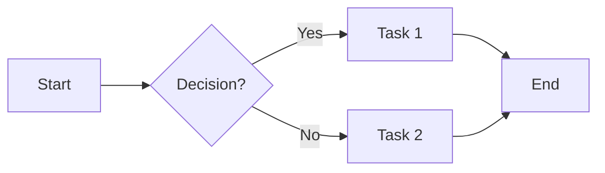
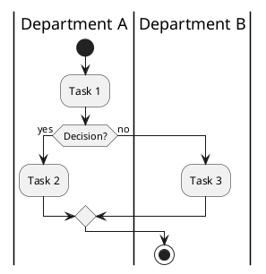

# Process Documenter Skill

## Overview

The **Process Documenter** skill transforms business process descriptions, meeting minutes, or Q&A interviews into professional process documentation with multiple diagram formats (BPMN, Mermaid, PlantUML, Data Flow Diagrams).

**Skill Name**: `process-documenter`
**Location**: `.claude/skills/process-documenter/`
**Author**: Risk Agent Team
**Version**: 1.0
**Date**: January 2025

---

## What This Skill Does

### Core Capabilities

1. **Extracts Process Information**
   - Analyzes meeting minutes or process descriptions
   - Identifies steps, decision points, participants, systems
   - Detects swim lanes (departments/roles)
   - Extracts critical controls and data flows

2. **Recommends Diagram Formats**
   - Analyzes process characteristics (swim lanes, complexity, governance)
   - Recommends optimal format (BPMN, Mermaid, PlantUML, DFD)
   - Explains rationale for recommendation

3. **Generates Multiple Diagram Types**
   - **BPMN 2.0**: Industry-standard with horizontal swim lanes, message flows, sub-processes
   - **Mermaid LR**: Git-friendly left-to-right diagrams
   - **PlantUML**: Vertical swim lanes for technical documentation
   - **Data Flow Diagrams**: System interactions and data transformations

4. **Creates Comprehensive Documentation**
   - Process overview and objectives
   - Detailed step-by-step descriptions
   - Decision point explanations
   - Swim lane responsibility matrix
   - Critical controls and quality gates
   - Inputs/outputs table
   - Timing and frequency
   - Exception handling

5. **Ensures Quality**
   - Validates sequence ordering (critical controls before execution)
   - Distinguishes departments from systems
   - Checks for missing steps
   - Flags potential issues

---

## When to Use This Skill

### ✅ Use When

- Documenting operational processes (approvals, workflows)
- Creating governance process flows (MLRC, committee processes)
- Mapping cross-departmental workflows
- Converting meeting minutes into process diagrams
- Documenting system interactions (data flows)
- Improving existing process documentation

### ✅ Trigger Phrases

The skill automatically activates when you say:
- "Document this business process"
- "Create a BPMN diagram for..."
- "Map out our approval workflow"
- "Generate process flow for..."
- "I have meeting minutes about [process], can you diagram it?"
- "Show data flow between systems"

### ❌ Don't Use For

- Code documentation (use code documentation tools)
- Data schemas (use ERD tools)
- Project plans (use project management tools)
- Organization charts (use org chart tools)

---

## How to Use

### Mode 1: From Meeting Minutes

```bash
# Example
"I have meeting minutes from our stress testing parameterisation review.
Can you create process documentation?"

[Paste meeting minutes or provide file path]
```

**What Happens:**
1. Skill reads meeting minutes
2. Extracts process information
3. Asks clarifying questions if information is missing
4. Recommends diagram format(s)
5. Generates diagrams and documentation

### Mode 2: Interactive Q&A

```bash
# Example
"Document our loan approval process"
```

**What Happens:**
1. Skill asks structured questions:
   - How many departments are involved?
   - What are the major steps?
   - What are the decision points?
   - What are the critical controls?
   - What systems are involved?
2. Analyzes your responses
3. Recommends diagram format(s)
4. Generates diagrams and documentation

### Mode 3: From Process Description

```bash
# Example
"Here's our process description: [paste text].
Create BPMN diagram and documentation."
```

**What Happens:**
1. Skill analyzes description
2. Asks clarifying questions if needed
3. Generates diagrams and documentation

---

## Output Structure

### Files Created

All files are saved to:
```
/Users/gavinslater/projects/riskagent/data/icbc_standard_bank/Processes/
  └── [Business Area]/
      └── [Process Name]/
          └── docs/
              ├── process-analysis-[name].md      # Comprehensive documentation
              ├── [name]-bpmn.xml                 # BPMN 2.0 diagram
              ├── [name]-mermaid.md               # Mermaid diagrams
              ├── [name]-dfd.md                   # Data flow diagram (if systems)
              └── [name]-plantuml.puml            # PlantUML (optional)
```

### Documentation Contents

The generated `process-analysis-[name].md` includes:

1. **Process Overview**
   - Name, business area, purpose
   - Trigger events and frequency
   - Regulatory/policy requirements

2. **Process Flow Diagrams**
   - Mermaid diagrams (vertical and horizontal)
   - Link to BPMN file
   - Data flow diagram (if applicable)

3. **Detailed Process Steps**
   - Step-by-step descriptions
   - Actor (who performs each step)
   - Inputs and outputs
   - Decision criteria

4. **Swim Lane Summary**
   - Department/role responsibilities
   - Key activities by swim lane

5. **Key Decision Points**
   - Decision criteria
   - Options and outcomes
   - Impact of each choice

6. **Data Flows**
   - Process inputs (sources, formats)
   - Process outputs (destinations, formats)
   - Data transformations

7. **Timing & Frequency**
   - Process duration
   - Phase durations
   - Deadlines and SLAs

8. **Critical Controls**
   - Approval gates
   - Reconciliation points
   - Quality checks
   - Sequence validation

9. **Exception Handling**
   - Error scenarios
   - Escalation paths
   - Recovery procedures

---

## Example Usage

### Example 1: Market Risk Stress Testing

**Input:**
```
"I have meeting minutes about our stress testing parameterisation process.
[Provides meeting minutes discussing: Pillar vs PoW stresses, MLRC approval,
FMDM reconciliation, Front Office consultation]"
```

**Output Generated:**
- `process-analysis-stress-parameterisation.md` (40+ pages)
- `stress-parameterisation-bpmn.xml` (3 swim lanes: Market Risk, Front Office, Asset Control)
- `stress-parameterisation-mermaid.md` (Vertical TB + Horizontal LR diagrams)
- `stress-parameterisation-dfd.md` (FMDM → Vespa/Murex data flow)

**Key Features Used:**
- BPMN with 3 horizontal swim lanes
- Message flows (Market Risk ↔ Front Office, Market Risk → Asset Control)
- Decision points (Pillar vs PoW, Reconciliation OK?)
- Sub-process (Top Risk Analysis)
- Critical control validation (Reconciliation BEFORE distribution)

### Example 2: Loan Approval Workflow

**Input:**
```
"Document our loan approval process. We have 4 departments:
Origination, Credit Risk, Compliance, Finance.
Process starts when customer submits application..."
```

**Output Generated:**
- `process-analysis-loan-approval.md`
- `loan-approval-bpmn.xml` (4 swim lanes)
- `loan-approval-mermaid.md`

**Features:**
- Decision points (Credit score check, Compliance review)
- Approval gates (Credit Risk approval, Finance sign-off)
- Exception handling (If declined, notify customer)
- Message flows (Origination → Credit Risk, etc.)

### Example 3: System Data Flow

**Input:**
```
"Show how data flows from trading systems through FMDM to calculation engines.
Trading systems send positions to FMDM. FMDM validates, stores, then distributes
to Vespa and Murex GTS for stress calculations."
```

**Output Generated:**
- `fmdm-data-flow-dfd.md` (Data flow diagram)
- `process-analysis-fmdm-data-flow.md`

**Features:**
- External entities (Trading systems, Market Data)
- Processes (Validation, Transformation, Distribution)
- Data stores (FMDM Repository, Vespa DB, Murex DB)
- Data flows (Positions, Validated data, Scenarios)

---

## Diagram Format Guide

### BPMN 2.0

**When Recommended:**
- 2+ departments involved
- Formal governance process
- Banking/regulatory process
- Complex process with sub-processes

**Features:**
- ✅ Horizontal swim lanes
- ✅ Message flows (cross-department communication)
- ✅ Sub-processes (collapsed activities)
- ✅ Industry-standard notation
- ✅ Opens in demo.bpmn.io

**Example Elements:**
- Tasks: `Review scenario`, `Upload to FMDM`
- Gateways: `Reconciliation OK?`, `Scenario type?`
- Events: `Start`, `Complete`
- Message flows: Dashed lines between swim lanes

### Mermaid LR

**When Recommended:**
- Simple process (1-2 swim lanes)
- Version control important
- GitHub rendering needed
- Iterative development

**Features:**
- ✅ Left-to-right flow
- ✅ Git-friendly (text-based)
- ✅ Renders in GitHub/GitLab
- ✅ Quick iteration
- ⚠️ Limited swim lane support

**Syntax:**


### PlantUML

**When Recommended:**
- Vertical flow preferred
- Technical audience
- Decision trees
- State machines

**Features:**
- ✅ Vertical swim lanes
- ✅ Clear decision logic
- ✅ Text-based
- ⚠️ Horizontal swim lanes not supported

**Syntax:**


### Data Flow Diagram (DFD)

**When Recommended:**
- System interactions primary focus
- Data transformations important
- Multiple systems involved
- Need to show data stores

**Features:**
- ✅ External entities (users, systems)
- ✅ Processes (transformations)
- ✅ Data stores (databases, files)
- ✅ Data flows (labeled arrows)

**Levels:**
- **Context (Level 0)**: High-level, one main process
- **Level 1**: Major processes
- **Level 2**: Detailed sub-processes

---

## Best Practices

### 1. Provide Clear Information

**Good:**
```
"Our process has 3 departments: Market Risk parameterises scenarios,
Front Office reviews and provides feedback, Asset Control uploads to FMDM
and reconciles against Excel golden source BEFORE distributing to Vespa/Murex."
```

**Avoid:**
```
"We have a process where people review stuff and upload it."
```

### 2. Specify Critical Controls

**Always mention:**
- Reconciliation points and their sequence
- Approval gates
- Quality checks
- When they occur (before/after what step)

**Example:**
```
"Important: FMDM reconciliation must happen AFTER upload but BEFORE
distribution to calculation systems."
```

### 3. Distinguish Departments from Systems

**Clear:**
- "Asset Control (department) uploads parameters to FMDM (system)"
- "Market Risk (department) stores data in Excel (golden source)"

**Confusing:**
- "Asset Control system uploads parameters" (Is "Asset Control system" = FMDM?)

### 4. Request Specific Refinements

**Good:**
```
"Move the reconciliation step to before the distribution step"
"Add a sub-process for Top Risk Analysis"
"Change decision point label from 'Type?' to 'Scenario type: Pillar or PoW?'"
```

**Avoid:**
```
"Fix the flow" (too vague)
"Make it better" (unclear)
```

### 5. Mention Message Flows

**If cross-department communication:**
```
"Market Risk sends parameters to Front Office for consultation.
Front Office sends feedback back if they disagree."
```

This creates message flows in BPMN (dashed lines between swim lanes).

---

## Quality Assurance Features

### Sequence Validation

The skill validates that critical controls happen in the correct sequence:

**✅ Correct:**
```
Upload to FMDM → Reconcile FMDM vs Excel → If OK: Distribute to Vespa/Murex
```

**❌ Incorrect:**
```
Upload to FMDM → Distribute to Vespa/Murex → Reconcile FMDM vs Excel
```

**Lesson:** Quality gates BEFORE execution, not after.

### Department vs System Distinction

The skill ensures clarity:

**✅ Correct:**
- Swim Lane: "Asset Control (RAV/Market Risk)" (department)
- Task: "Upload parameters to FMDM" (system)

**❌ Confusing:**
- Swim Lane: "FMDM" (system name in swim lane)
- Task: "Asset Control uploads" (no system mentioned)

### Missing Information Detection

If the skill detects gaps, it asks clarifying questions:

**Examples:**
- "The document mentions reconciliation. When exactly does it happen relative to the distribution step?"
- "Is 'Asset Control system' referring to the department or a specific system like FMDM?"
- "What happens if MLRC defers approval?"

---

## Troubleshooting

### Issue: "I can't see the BPMN diagram"

**Solution:** BPMN XML files need a BPMN editor:
1. Go to https://demo.bpmn.io/
2. Click "Open File"
3. Select the generated `[name]-bpmn.xml` file

### Issue: "Mermaid diagram doesn't render"

**Solution:**
- **GitHub/GitLab**: Should render automatically in .md files
- **VSCode**: Install "Markdown Preview Mermaid Support" extension
- **Online**: Use https://mermaid.live/

### Issue: "The reconciliation is in the wrong place"

**Solution:** Be explicit about sequence:
```
"The reconciliation should happen after FMDM upload but before distribution to Vespa/Murex"
```

The skill will regenerate diagrams with correct order.

### Issue: "Swim lanes are vertical, not horizontal"

**Solution:** This is a limitation of Mermaid and PlantUML.

For **horizontal swim lanes**, use BPMN:
```
"Generate BPMN diagram with horizontal swim lanes"
```

### Issue: "Too many boxes, diagram is cluttered"

**Solution:** Request sub-processes:
```
"Collapse 'Top Risk Analysis' as a sub-process"
```

Or create Level 1 and Level 2 diagrams:
```
"Create a high-level diagram (5-10 boxes) and a detailed diagram"
```

---

## Advanced Features

### Sub-Processes

For complex activities, request sub-processes:

**Collapsed:**
```
"Show 'Top Risk Analysis' as a single collapsed box with a link to a separate diagram"
```

**Expanded:**
```
"Expand 'Top Risk Analysis' to show its internal steps:
1. Identify risks
2. Rank by severity
3. Select top 3-5
4. Determine scenarios"
```

### Message Flows (BPMN)

For cross-department communication:

```
"Add message flows:
- Market Risk → Front Office: 'Send parameters for consultation'
- Front Office → Market Risk: 'Feedback (if disagree)'
- Market Risk → Asset Control: 'MLRC-approved parameters'"
```

Creates dashed lines between swim lanes.

### Exception Handling

Document error paths:

```
"Add exception handling:
- If reconciliation fails: Investigate → Correct FMDM → Re-reconcile
- If MLRC defers: Market Risk revises → Resubmit next month"
```

### Data Transformations (DFD)

Show how data changes:

```
"Show data transformation:
Economic narrative (Word) → Parameterisation → Shock values (Excel) →
FMDM upload → System format → Stress results"
```

---

## Skill Files Reference

### Main Files

| File | Purpose |
|------|---------|
| `SKILL.md` | Skill definition (triggers, description, allowed tools) |
| `README.md` | User guide and quick start |
| `reference.md` | Comprehensive technical guide for all diagram formats |

### Templates

| File | Purpose |
|------|---------|
| `templates/process-interview-template.md` | Structured Q&A questions (12 sections, 120+ questions) |
| `templates/document-extraction-template.md` | Guide for extracting process info from documents |

### Examples

| File | Purpose |
|------|---------|
| `examples/stress-testing-example.md` | Complete reference example (40+ pages) |

---

## Tips for Success

### 1. Start Simple

For first use, try a simple 2-3 step process:
```
"Document this approval: Employee submits request → Manager approves/rejects → HR processes"
```

### 2. Add Complexity Gradually

Once basic flow works, add:
- Decision points
- Additional swim lanes
- Critical controls
- Exception handling

### 3. Use Meeting Minutes

If you have meeting minutes discussing a process:
```
"I have meeting minutes from [meeting]. Create process documentation.
[Paste or provide file path]"
```

### 4. Iterate Based on Feedback

Review generated diagrams and request changes:
```
"Move Step 3 to before Step 2"
"Add a decision point after Step 4: 'Amount > $1000?'"
"Change 'System' to 'FMDM'"
```

### 5. Request Multiple Formats

```
"Generate BPMN for governance review and Mermaid for version control"
```

---

## Integration with Other Skills

The Process Documenter skill can be combined with:

- **Meeting Minutes Skill** (`/meeting-minutes`):
  - Use meeting-minutes to structure notes
  - Then use process-documenter to create diagrams from structured minutes

- **Change Agent Skills**:
  - Document current process
  - Identify improvement opportunities
  - Document future state process
  - Compare before/after

---

## Version History

### v1.0 (January 2025)

**Initial Release:**
- BPMN 2.0 with horizontal swim lanes, message flows, sub-processes, collapsed activities
- Mermaid LR diagrams (left-to-right)
- PlantUML vertical swim lanes
- Data flow diagrams (DFD)
- Meeting minutes extraction
- Interactive Q&A mode
- Document analysis mode
- ICBC Standard Bank folder structure integration
- Comprehensive documentation generation
- Sequence validation for critical controls
- Department vs system distinction
- Exception handling support

**Capabilities:**
- Supports 3 input modes (meeting minutes, Q&A, process description)
- Generates 4 diagram formats (BPMN, Mermaid, PlantUML, DFD)
- Creates comprehensive markdown documentation
- Validates sequence ordering
- Asks clarifying questions for missing information
- Supports iterative refinement

---

## Related Documentation

- [Skills Guide](06-skills-guide.md) - Overview of all skills
- [Meeting Minutes Skill](06a-meeting-minutes.md) - Structure meeting notes
- [ITC Template Filler](06b-itc-template-filler.md) - Fill ITC templates
- [ICC Business Case Filler](06c-icc-business-case-filler.md) - Fill ICC templates

---

## Support

For questions or issues:

1. **Check the reference guide**: `.claude/skills/process-documenter/reference.md`
2. **Review examples**: `.claude/skills/process-documenter/examples/stress-testing-example.md`
3. **Use interview template**: `.claude/skills/process-documenter/templates/process-interview-template.md`
4. **Check this documentation**: `docs/06d-process-documenter.md`

---

## Summary

The **Process Documenter** skill:

✅ Transforms process information into professional diagrams and documentation
✅ Supports 3 input modes (meeting minutes, Q&A, process description)
✅ Generates 4 diagram formats (BPMN, Mermaid, PlantUML, DFD)
✅ Creates comprehensive markdown documentation
✅ Validates sequence ordering and critical controls
✅ Distinguishes departments from systems
✅ Supports sub-processes, message flows, exception handling
✅ Outputs to ICBC Standard Bank folder structure
✅ Enables iterative refinement

**Use it whenever you need to document business processes, workflows, or system interactions!**
