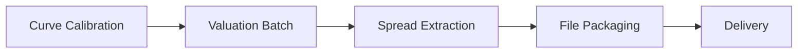

---
# Document Metadata
document_id: CR-IS-BRD-001
document_name: CR Instrument Spread Feed - Business Requirements Document
version: 1.0
effective_date: 2025-01-02
next_review_date: 2026-01-02
owner: Market Risk Technology
approving_committee: Risk Technology Change Board

# Taxonomy Reference
parent_node: L7-Systems/market-risk/feeds
feed_family: Credit Sensitivities
feed_id: CR-IS-001
---

# CR Instrument Spread Feed - Business Requirements Document

**Meridian Global Bank - Market Risk Technology**

| Document Control | |
|-----------------|---|
| **Document ID** | CR-IS-BRD-001 |
| **Version** | 1.0 |
| **Effective Date** | 2 January 2025 |
| **Owner** | Market Risk Technology |
| **Approver** | Risk Technology Change Board |

---

## 1. Executive Summary

### 1.1 Purpose

This Business Requirements Document (BRD) defines the requirements for the Credit Instrument Spread feed (also known as CR Zero Spread CDS) from Murex (VESPA module) to downstream risk systems. This feed provides the **bond zero coupon spread** used in the computation of bond P&L prices for credit-sensitive instruments.

### 1.2 Scope

| In Scope | Out of Scope |
|----------|--------------|
| Credit default swap (CDS) spreads | Real-time spread streaming |
| Credit-linked note spreads | Intraday spread updates |
| Bond zero coupon spreads | Spread curve construction |
| Credit index (CRDI) spreads | Historical spread analysis |
| Daily T+1 extraction | Credit spread volatility |

### 1.3 Business Context

The Credit Instrument Spread feed provides the **zero coupon spread level** for each credit position at each tenor pillar. Unlike the other CR feeds which provide sensitivities (P&L impact per basis point move), this feed provides the **actual spread value** used in valuation.

Key business applications include:
- **P&L Attribution**: Decomposing P&L into carry vs. spread movement
- **Mark-to-Market**: Validating bond prices against market spreads
- **Credit Monitoring**: Tracking spread levels across credit portfolio
- **Regulatory Reporting**: FRTB spread risk charge calculations
- **Risk Analytics**: Spread-based risk factor analysis

---

## 2. Business Requirements

### 2.1 Functional Requirements

#### BR-001: Spread Data Extraction
**Priority**: Critical
**Description**: Extract daily credit instrument spreads from Murex VESPA module for all active credit-sensitive positions.

**Acceptance Criteria**:
- Extract spreads for all active trades (STP status: RELE, VERI, STTL)
- Include both Non-CRDI (single-name) and CRDI (index) positions
- Capture spread at each tenor pillar point
- Filter by legal entity (MGB)
- Complete extraction by 04:00 GMT T+1

#### BR-002: Non-CRDI Position Coverage
**Priority**: Critical
**Description**: Extract spreads for single-name credit positions including CDS, bonds, and credit-linked notes.

**Acceptance Criteria**:
- Cover all CDS positions with valid issuer
- Cover all corporate and sovereign bonds
- Cover credit-linked notes
- Exclude positions with null issuer or null zero date
- Link to counterparty static data for CIF and GLOBUS_ID

#### BR-003: CRDI Position Coverage
**Priority**: High
**Description**: Extract spreads for credit index positions including CDX and iTraxx indices.

**Acceptance Criteria**:
- Cover all credit index trades (GROUP = 'CRDI')
- Use instrument label as issuer and curve name
- Set recovery rate to 0 for index positions
- Link to credit index definition for index details

#### BR-004: Spread Calculation
**Priority**: Critical
**Description**: Provide the bond zero coupon spread used in valuation.

**Acceptance Criteria**:
- Source: M_ZERO_SPRE field (divided by 100 per CM-6402)
- Unit: Decimal (e.g., 0.0250 = 250 basis points)
- Precision: 6 decimal places
- Include spread for each tenor pillar

#### BR-005: Regional Processing
**Priority**: High
**Description**: Support regional extraction aligned with market data sets.

**Acceptance Criteria**:
- London (LN): European markets, GMT close
- Hong Kong (HK): Asian markets, HKT close
- New York (NY): Americas markets, EST close
- Singapore (SP): Additional Asian coverage, SGT close

### 2.2 Non-Functional Requirements

#### NFR-001: Data Quality
- Field validation per data dictionary
- Cross-reference with counterparty master
- Spread reasonableness checks (flag outliers)

#### NFR-002: Performance
- Complete regional extraction within 60 minutes
- Handle 50,000+ records per region
- File size limit: 100MB per region

#### NFR-003: Availability
- 99.9% availability for daily batch
- Automated retry on transient failures
- Manual re-run capability

---

## 3. Data Requirements

### 3.1 Output Field Summary

| # | Field | Type | Description | Business Use |
|---|-------|------|-------------|--------------|
| 1 | TRADE_NUM | Numeric | Murex trade ID | Position linking |
| 2 | FAMILY | VarChar | Trade family | Product classification |
| 3 | GROUP | VarChar | Trade group | Product type |
| 4 | TYPE | VarChar | Trade type | Product subtype |
| 5 | TYPOLOGY | VarChar | Trade typology | Trade strategy |
| 6 | PORTFOLIO | VarChar | Trading portfolio | Book mapping |
| 7 | INSTRUMENT | VarChar | PL instrument | Instrument identification |
| 8 | ISSUER | VarChar | Issuer label | Credit entity |
| 9 | CURVE_NAME | VarChar | Credit curve name | Curve identification |
| 10 | DATE | VarChar | Tenor pillar | Term structure point |
| 11 | RECOVERY_RATE | Numeric | Recovery rate (%) | Recovery assumption |
| 12 | **SPREAD** | Numeric | **Zero coupon spread** | **Key metric** |
| 13 | CURRENCY | VarChar | Currency | Denomination |
| 14 | CIF | Numeric | Customer ID | Counterparty link |
| 15 | GLOBUS_ID | VarChar | External issuer ID | External reference |
| 16 | COUNTRY | VarChar | Country of risk | Geographic exposure |
| 17 | ISIN | VarChar | Reference ISIN | Security reference |
| 18 | MATURITY | Date | Trade maturity | Tenor calculation |
| 19 | UNDERLYING | VarChar | Reference obligation | CDS underlying |

**Total Fields**: 19 (Note: Unlike RR01/RR02, no RESTRUCT field)

### 3.2 SPREAD Field Details

The SPREAD field is the **key metric** for this feed:

| Property | Value |
|----------|-------|
| **Source** | M_ZERO_SPRE / 100 (per CM-6402) |
| **Unit** | Decimal (percentage) |
| **Example** | 0.025000 = 2.5% = 250 bps |
| **Precision** | 6 decimal places |

**Business Interpretation**:
- **Positive spread**: Credit risk premium over risk-free rate
- **Higher spread**: Higher perceived credit risk
- **Zero spread**: Typically for high-quality sovereign or CRDI index-level

### 3.3 Non-CRDI vs CRDI Handling

| Aspect | Non-CRDI | CRDI |
|--------|----------|------|
| Source Table | TBL_VESPA_SENS_REP | TBL_VESPA_SENSCIR_REP |
| ISSUER | M_ISSUER (or PL_INSTRU if null) | M_PL_INSTRU |
| CURVE_NAME | M_CURVE_NA1 | M_PL_INSTRU |
| DATE | M_DATE__ZER | Empty string |
| RECOVERY_RATE | M_RATE | 0 |
| CIF | From counterparty UDF | 0 |
| GLOBUS_ID | From counterparty UDF | Empty string |
| COUNTRY | From counterparty UDF | Empty string |
| ISIN | From bond/CDS reference | Empty string |
| UNDERLYING | From CDS reference | Empty string |

---

## 4. Source System Requirements

### 4.1 Murex VESPA Module

| Component | Requirement |
|-----------|-------------|
| **Valuation Batch** | Complete by 21:00 GMT |
| **Spread Calculation** | Zero coupon spread methodology |
| **Data Availability** | All active trades valued |
| **Curve Calibration** | Credit curves calibrated |

### 4.2 Simulation Views

| View | Purpose |
|------|---------|
| VW_Vespa_Sensitivities | Non-CRDI spread data |
| VW_Vespa_Sensitivities_CRDI | CRDI spread data |

### 4.3 Reference Data

| Source | Data |
|--------|------|
| SB_CP_REP | Counterparty static (CIF, GLOBUS_ID, Country) |
| TBL_CRD_RECOVERY_REP | CDS reference obligations (ISIN, UNDERLYING) |
| SB_CRI_DEF_REP | Credit index definitions |
| SB_TP_REP | Trade details (maturity, STP status) |

---

## 5. Integration Requirements

### 5.1 Target Systems

| System | Usage | Priority |
|--------|-------|----------|
| Risk Data Warehouse | Central storage, reporting | Critical |
| Plato (Risk Engine) | FRTB spread risk calculations | High |
| VESPA Reporting | Regulatory reporting | High |
| P&L Attribution | Spread carry analysis | Medium |
| Credit Risk Systems | Spread monitoring | Medium |

### 5.2 File Delivery

| Property | Specification |
|----------|---------------|
| **Protocol** | SFTP |
| **Format** | CSV (semicolon delimited) |
| **Encoding** | UTF-8 |
| **Packaging** | ZIP (MxMGB_MR_Credit_Sens_Region_YYYYMMDD.zip) |
| **Delivery Time** | 05:30 GMT |

---

## 6. Relationship to Other CR Feeds

### 6.1 Credit Sensitivities Suite

| Feed | Key Metric | Purpose |
|------|------------|---------|
| CR Delta Zero | CS01_ZERO | P&L per 1bp spread move (zero rates) |
| CR Delta Par | CS01_PAR | P&L per 1bp spread move (par rates) |
| CR Basis Rate | Basis sensitivity | Pure basis risk |
| CR Par CDS Rate | Par CDS sensitivity | CDS-specific risk |
| **CR Instrument Spread** | **Spread level** | **Actual spread value** |
| CR Corr01 | Correlation sensitivity | Correlation risk |
| CR RR01 | Recovery sensitivity (with propagation) | Recovery risk (total) |
| CR RR02 | Recovery sensitivity (without propagation) | Recovery risk (direct) |

### 6.2 Unique Characteristics of CR Instrument Spread

Unlike the other CR feeds which provide **sensitivities** (P&L change per unit move), the CR Instrument Spread feed provides:

- **Actual spread level** (not sensitivity)
- **Valuation input** (used in bond pricing)
- **Market observable** (can be compared to market quotes)

This feed answers the question: "What is the credit spread embedded in my position?" rather than "How much would I make/lose if spreads moved?"

---

## 7. Processing Schedule

### 7.1 Daily Timeline

| Time (GMT) | Event |
|------------|-------|
| 18:00 | Credit curve calibration complete |
| 21:00 | Valuation batch complete |
| 03:00 | Extraction batch start |
| 04:00 | Extraction complete |
| 05:00 | Packaging |
| 05:30 | Delivery |

### 7.2 Dependencies

---

## 8. Acceptance Criteria

### 8.1 UAT Requirements

| Test Case | Expected Result |
|-----------|-----------------|
| Non-CRDI extraction | All single-name positions with valid issuer extracted |
| CRDI extraction | All index positions extracted with 0 recovery rate |
| Spread calculation | SPREAD = M_ZERO_SPRE / 100 |
| Regional files | Separate files per region (LN, HK, NY, SP) |
| File format | 19 fields, semicolon delimiter, UTF-8 |
| Data validation | All mandatory fields populated |

### 8.2 Go-Live Criteria

- [ ] All UAT test cases passed
- [ ] Reconciliation to source views complete
- [ ] Downstream systems confirmed receipt
- [ ] Exception handling tested
- [ ] Operational runbook approved

---

## 9. Related Documents

| Document | ID | Relationship |
|----------|-----|--------------|
| [CR Instrument Spread IT Config](./cr-instrument-spread-config.md) | CR-IS-CFG-001 | Technical configuration |
| [CR Instrument Spread IDD](./cr-instrument-spread-idd.md) | CR-IS-IDD-001 | Interface design |
| [CR Delta Zero BRD](../cr-delta-zero/cr-delta-zero-brd.md) | CR-DZ-BRD-001 | Related CS01 feed |
| [Feeds Overview](../feeds-overview.md) | MR-L7-003 | Parent document |
| [Data Dictionary](../../data-dictionary.md) | MR-L7-002 | Field definitions |

---

## 10. Document Control

### 10.1 Version History

| Version | Date | Change | Author |
|---------|------|--------|--------|
| 1.0 | 2025-01-02 | Initial version | Risk Technology |

### 10.2 Approval

| Role | Name | Date |
|------|------|------|
| Business Owner | Head of Market Risk | |
| Technical Owner | Head of Risk Technology | |
| Approver | Risk Technology Change Board | |

---

*End of Document*
