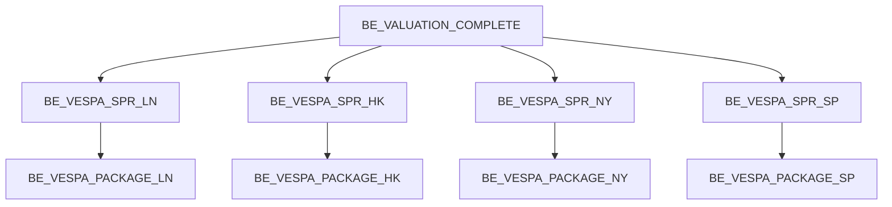

---
# Document Metadata
document_id: CR-IS-CFG-001
document_name: CR Instrument Spread Feed - IT Configuration Document
version: 1.0
effective_date: 2025-01-02
next_review_date: 2026-01-02
owner: Risk Technology
approving_committee: Risk Technology Change Board

# Parent Reference
parent_document: CR-IS-BRD-001  # CR Instrument Spread BRD
feed_id: CR-IS-001
---

# CR Instrument Spread Feed - IT Configuration Document

**Meridian Global Bank - Risk Technology**

| Document Control | |
|-----------------|---|
| **Document ID** | CR-IS-CFG-001 |
| **Version** | 1.0 |
| **Effective Date** | 2 January 2025 |
| **Owner** | Risk Technology |
| **Approver** | Risk Technology Change Board |

---

## 1. Configuration Overview

### 1.1 Component Summary

This document details the Murex GOM (Global Object Model) configuration for the CR Instrument Spread feed extraction. The feed provides **bond zero coupon spreads** used in credit instrument valuation.

| Component Type | Count | Purpose |
|----------------|-------|---------|
| Simulation Views | 2 | Non-CRDI and CRDI spread sourcing |
| Datamart Tables | 4 | Sensitivity and reference data storage |
| Processing Scripts | 4 | Regional spread extraction |
| Data Extractor | 1 | SQL extraction definition |
| Extraction Request | 1 | Parameter-driven extraction |
| Batch Events | 4 | Regional scheduling |

### 1.2 Data Flow Architecture

```
┌─────────────────────────────────────────────────────────────────────┐
│                     MUREX VALUATION ENGINE                          │
├─────────────────────────────────────────────────────────────────────┤
│  VW_Vespa_Sensitivities          VW_Vespa_Sensitivities_CRDI       │
│  (Non-CRDI spreads)              (CRDI spreads)                     │
└──────────────┬────────────────────────────┬─────────────────────────┘
               │                            │
               ▼                            ▼
┌─────────────────────────────────────────────────────────────────────┐
│                      DATAMART TABLES                                │
├─────────────────────────────────────────────────────────────────────┤
│  TBL_VESPA_SENS_REP              TBL_VESPA_SENSCIR_REP             │
│  (Non-CRDI)                       (CRDI)                            │
│                                                                     │
│  SB_CP_REP                       SB_CRI_DEF_REP                     │
│  (Counterparty)                  (Index Definition)                 │
│                                                                     │
│  TBL_CRD_RECOVERY_REP            SB_TP_REP                         │
│  (CDS Reference)                 (Trade Details)                    │
└──────────────────────────────────┬──────────────────────────────────┘
                                   │
                                   ▼
┌─────────────────────────────────────────────────────────────────────┐
│                   DATA EXTRACTOR: DE_VESPA_CR_SPREAD                │
├─────────────────────────────────────────────────────────────────────┤
│  SQL: Non-CRDI query UNION ALL CRDI query                          │
│  Filter: STP_STATUS IN ('RELE','VERI','STTL')                      │
│  Filter: M_TP_LENTDSP = @LegalEntity (MGB)                         │
│  Transformation: M_ZERO_SPRE / 100 AS SPREAD                       │
└──────────────────────────────────┬──────────────────────────────────┘
                                   │
                                   ▼
┌─────────────────────────────────────────────────────────────────────┐
│               EXTRACTION REQUEST: ER_VESPA_CR_Instrument_Spread     │
├─────────────────────────────────────────────────────────────────────┤
│  Parameters: @MxDataSetKey, @LegalEntity                           │
│  Output: CSV (semicolon delimited)                                 │
└──────────────────────────────────┬──────────────────────────────────┘
                                   │
                    ┌──────────────┼──────────────┐
                    │              │              │
                    ▼              ▼              ▼
              ┌─────────┐    ┌─────────┐    ┌─────────┐
              │   LN    │    │   HK    │    │   NY    │    ...
              │ Region  │    │ Region  │    │ Region  │
              └─────────┘    └─────────┘    └─────────┘
                    │              │              │
                    ▼              ▼              ▼
┌─────────────────────────────────────────────────────────────────────┐
│  MxMGB_MR_Credit_Spread_{Region}_{YYYYMMDD}.csv          │
└─────────────────────────────────────────────────────────────────────┘
```

---

## 2. Simulation Views

### 2.1 VW_Vespa_Sensitivities (Non-CRDI)

| Property | Value |
|----------|-------|
| **View Name** | VW_Vespa_Sensitivities |
| **Purpose** | Credit sensitivity data for non-index products |
| **Products** | CDS, Bonds, CLN, CDO (excluding CRDI) |
| **Key Fields** | M_ZERO_SPRE, M_DATE__ZER, M_CURVE_NA1 |

**Relevant Fields for Spread Feed**:

| Field | Type | Description |
|-------|------|-------------|
| M_TRADE_NUM | Numeric | Trade identifier |
| M_FAMILY | VarChar | Trade family |
| M_GROUP | VarChar | Trade group |
| M_TYPE | VarChar | Trade type |
| M_TYPOLOGY | VarChar | Trade typology |
| M_PORTFOLIO | VarChar | Portfolio code |
| M_PL_INSTRU | VarChar | PL instrument |
| M_ISSUER | VarChar | Issuer label |
| M_CURVE_NA1 | VarChar | Credit curve name (zero) |
| M_DATE__ZER | VarChar | Tenor pillar date (zero) |
| M_RATE | Numeric | Recovery rate |
| **M_ZERO_SPRE** | **Numeric** | **Zero coupon spread (key field)** |
| M_CURRENCY2 | VarChar | Currency |
| M_REF_DATA | Numeric | Market data set reference |

### 2.2 VW_Vespa_Sensitivities_CRDI (CRDI)

| Property | Value |
|----------|-------|
| **View Name** | VW_Vespa_Sensitivities_CRDI |
| **Purpose** | Credit sensitivity data for index products |
| **Products** | CDX, iTraxx, other credit indices |
| **Key Fields** | M_ZERO_SPRE, M_LABEL, M_PL_INSTRU |

**Relevant Fields for Spread Feed**:

| Field | Type | Description |
|-------|------|-------------|
| M_TRADE_NUM | Numeric | Trade identifier |
| M_FAMILY | VarChar | Trade family |
| M_GROUP | VarChar | Trade group (always 'CRDI') |
| M_TYPE | VarChar | Trade type |
| M_LABEL | VarChar | Index label (used as TYPOLOGY) |
| M_PORTFOLIO | VarChar | Portfolio code |
| M_PL_INSTRU | VarChar | PL instrument (used as ISSUER, CURVE_NAME) |
| **M_ZERO_SPRE** | **Numeric** | **Zero coupon spread (key field)** |
| M_CURRENCY | VarChar | Currency |
| M_REF_DATA | Numeric | Market data set reference |

---

## 3. Datamart Tables

### 3.1 TBL_VESPA_SENS_REP (Primary - Non-CRDI)

| Property | Value |
|----------|-------|
| **Table Name** | DM.TBL_VESPA_SENS_REP |
| **Alias** | VSP |
| **Purpose** | Non-CRDI spread data storage |
| **Source View** | VW_Vespa_Sensitivities |
| **Refresh** | Daily batch |

**Key Fields**:

| Column | Type | Description |
|--------|------|-------------|
| M_TRADE_NUM | NUMBER(10) | Trade identifier |
| M_FAMILY | VARCHAR2(16) | Trade family |
| M_GROUP | VARCHAR2(5) | Trade group |
| M_TYPE | VARCHAR2(16) | Trade type |
| M_TYPOLOGY | VARCHAR2(21) | Trade typology |
| M_PORTFOLIO | VARCHAR2(20) | Portfolio code |
| M_PL_INSTRU | VARCHAR2(30) | PL instrument |
| M_ISSUER | VARCHAR2(50) | Issuer label |
| M_CURVE_NA1 | VARCHAR2(50) | Credit curve name |
| M_DATE__ZER | VARCHAR2(64) | Tenor pillar |
| M_RATE | NUMBER(12,6) | Recovery rate |
| **M_ZERO_SPRE** | **NUMBER(20,6)** | **Zero coupon spread (x100)** |
| M_CURRENCY2 | VARCHAR2(4) | Currency |
| M_REF_DATA | NUMBER(9) | Market data set key |

### 3.2 TBL_VESPA_SENSCIR_REP (CRDI)

| Property | Value |
|----------|-------|
| **Table Name** | DM.TBL_VESPA_SENSCIR_REP |
| **Alias** | VSP |
| **Purpose** | CRDI spread data storage |
| **Source View** | VW_Vespa_Sensitivities_CRDI |
| **Refresh** | Daily batch |

**Note**: In the source documentation, this table appears as `TBL_VESP_SENSCIR_REP` (typo - missing 'A'). Verify actual table name in production.

### 3.3 Supporting Tables

| Table | Alias | Purpose |
|-------|-------|---------|
| DM.SB_CP_REP | CP | Counterparty static data (CIF, GLOBUS_ID, Country) |
| DM.TBL_CRD_RECOVERY_REP | OBL | CDS reference obligations (ISIN, UNDERLYING) |
| DM.SB_TP_REP | TP | Trade details (maturity, STP status, legal entity) |
| DM.SB_CRI_DEF_REP | CRI | Credit index definitions |

---

## 4. Data Extractor Configuration

### 4.1 Extractor Definition

| Property | Value |
|----------|-------|
| **Extractor Name** | DE_VESPA_CR_SPREAD |
| **Type** | SQL |
| **Output Format** | CSV |
| **Delimiter** | Semicolon (;) |
| **Encoding** | UTF-8 |

### 4.2 Extraction SQL - Non-CRDI Component

```sql
SELECT
    VSP.M_TRADE_NUM AS TRADE_NUM,
    VSP.M_FAMILY AS FAMILY,
    VSP.M_GROUP AS M_GROUP,
    VSP.M_TYPE AS M_TYPE,
    VSP.M_TYPOLOGY AS TYPOLOGY,
    VSP.M_PORTFOLIO AS PORTFOLIO,
    VSP.M_PL_INSTRU AS INSTRUMENT,
    CASE WHEN VSP.M_ISSUER IS NULL
         THEN VSP.M_PL_INSTRU
         ELSE VSP.M_ISSUER
    END AS ISSUER,  -- For null issuer, use instrument label
    VSP.M_CURVE_NA1 AS CURVE_NAME,
    VSP.M_DATE__ZER AS M_DATE,
    VSP.M_RATE AS RECOVERY_RATE,
    (VSP.M_ZERO_SPRE / 100) AS SPREAD,  -- CM-6402: Divide by 100
    VSP.M_CURRENCY2 AS CURRENCY,
    CP.M_U_CIF_ID AS CIF,
    CP.M_U_GLOBID AS GLOBUS_ID,
    CP.M_U_RSK_CTRY AS COUNTRY,
    OBL.M_REF_OBLI1 AS ISIN,  -- Reference obligation ISIN
    TP.M_TP_DTEEXP AS MATURITY,
    OBL.M_REF_OBLIG AS UNDERLYING  -- Reference obligation label
FROM DM.TBL_VESPA_SENS_REP VSP
LEFT JOIN DM.SB_CP_REP CP ON (
    VSP.M_ISSUER = CP.M_DSP_LABEL
    AND CP.M_REF_DATA = @MxDataSetKey:N
)
LEFT JOIN DM.TBL_CRD_RECOVERY_REP OBL ON (
    VSP.M_TRADE_NUM = OBL.M_NB
    AND VSP.M_REF_DATA = OBL.M_REF_DATA
    AND VSP.M_GROUP = 'CDS'
)
INNER JOIN DM.SB_TP_REP TP ON (
    TP.M_REF_DATA = VSP.M_REF_DATA
    AND VSP.M_TRADE_NUM = TP.M_NB
    AND TP.M_TP_LENTDSP = @LegalEntity:C
    AND TP.M_STP_STATUS IN ('RELE', 'VERI', 'STTL')
)
WHERE VSP.M_REF_DATA = @MxDataSetKey:N
  AND VSP.M_DATE__ZER IS NOT NULL
  AND VSP.M_ISSUER IS NOT NULL  -- CM-6046
  AND VSP.M_GROUP <> 'CRDI'
```

### 4.3 Extraction SQL - CRDI Component

```sql
UNION ALL

SELECT
    VSP.M_TRADE_NUM AS TRADE_NUM,
    VSP.M_FAMILY AS FAMILY,
    VSP.M_GROUP AS M_GROUP,
    VSP.M_TYPE AS M_TYPE,
    VSP.M_LABEL AS TYPOLOGY,  -- Use label for CRDI
    VSP.M_PORTFOLIO AS PORTFOLIO,
    VSP.M_PL_INSTRU AS INSTRUMENT,
    VSP.M_PL_INSTRU AS ISSUER,  -- For CRDI, issuer = instrument label
    VSP.M_PL_INSTRU AS CURVE_NAME,  -- For CRDI, curve = instrument label
    '' AS M_DATE,  -- Empty for CRDI
    0 AS RECOVERY_RATE,  -- Zero for CRDI
    (VSP.M_ZERO_SPRE / 100) AS SPREAD,  -- CM-6402: Divide by 100
    VSP.M_CURRENCY AS CURRENCY,
    0 AS CIF,  -- Zero for CRDI
    '' AS GLOBUS_ID,  -- Empty for CRDI
    '' AS COUNTRY,  -- Empty for CRDI
    '' AS ISIN,  -- Empty for CRDI
    TP.M_TP_DTEEXP AS MATURITY,
    '' AS UNDERLYING  -- Empty for CRDI
FROM DM.TBL_VESPA_SENSCIR_REP VSP
INNER JOIN DM.SB_TP_REP TP ON (
    TP.M_REF_DATA = VSP.M_REF_DATA
    AND VSP.M_TRADE_NUM = TP.M_NB
    AND TP.M_TP_LENTDSP = @LegalEntity:C
    AND TP.M_STP_STATUS IN ('RELE', 'VERI', 'STTL')
)
LEFT JOIN DM.SB_CRI_DEF_REP CRI ON (
    VSP.M_PL_INSTRU = CRI.M_INDEX_LBL
    AND CRI.M_REF_DATA = @MxDataSetKey:N
)  -- For CRDI index definition
WHERE VSP.M_REF_DATA = @MxDataSetKey:N
  AND VSP.M_GROUP = 'CRDI'
```

### 4.4 Key SQL Elements

| Element | Purpose |
|---------|---------|
| UNION ALL | Combines Non-CRDI and CRDI results |
| CASE WHEN | Handles null issuer for Non-CRDI |
| M_ZERO_SPRE / 100 | CM-6402 transformation to decimal |
| LEFT JOIN SB_CP_REP | Enriches with counterparty data |
| LEFT JOIN TBL_CRD_RECOVERY_REP | Enriches with reference obligation data |
| LEFT JOIN SB_CRI_DEF_REP | Index definition for CRDI |
| INNER JOIN SB_TP_REP | Filters by legal entity and STP status |

### 4.5 Extraction Parameters

| Parameter | Type | Description | Example |
|-----------|------|-------------|---------|
| @MxDataSetKey | Numeric | Market data set identifier | 12345 |
| @LegalEntity | Character | Legal entity code | MGB |

---

## 5. Extraction Request Configuration

### 5.1 Request Definition

| Property | Value |
|----------|-------|
| **Request Name** | ER_VESPA_CR_Instrument_Spread |
| **Extractor** | DE_VESPA_CR_SPREAD |
| **Output Directory** | /data/extracts/vespa/cr_instrument_spread/ |
| **File Pattern** | MxMGB_MR_Credit_Spread_{Region}_{YYYYMMDD}.csv |

### 5.2 Parameter Mapping

| Parameter | Source | Description |
|-----------|--------|-------------|
| MxDataSetKey | Batch variable | Regional market data set |
| LegalEntity | Fixed | MGB |

### 5.3 Regional Market Data Sets

| Region | Data Set | Description |
|--------|----------|-------------|
| LN | MGB_LN_EOD | London end-of-day |
| HK | MGB_HK_EOD | Hong Kong end-of-day |
| NY | MGB_NY_EOD | New York end-of-day |
| SP | MGB_SP_EOD | Singapore end-of-day |

---

## 6. Processing Script Configuration

### 6.1 Script Overview

| Region | Script Name | Purpose |
|--------|-------------|---------|
| LN | LN_MR_VESPA_SPR_RPT | London extraction |
| HK | HK_MR_VESPA_SPR_RPT | Hong Kong extraction |
| NY | NY_MR_VESPA_SPR_RPT | New York extraction |
| SP | SP_MR_VESPA_SPR_RPT | Singapore extraction |

### 6.2 Script Template

```bash
#!/bin/bash
# {Region}_MR_VESPA_SPR_RPT
# CR Instrument Spread extraction for {Region}

REGION="{Region}"
BUSINESS_DATE=$(date +%Y%m%d)
DATA_SET_KEY="{DataSetKey}"
LEGAL_ENTITY="MGB"

# Set parameters
export MX_DATA_SET_KEY=$DATA_SET_KEY
export MX_LEGAL_ENTITY=$LEGAL_ENTITY

# Execute extraction
mx_extract.sh -r ER_VESPA_CR_Instrument_Spread \
              -p MxDataSetKey=$DATA_SET_KEY \
              -p LegalEntity=$LEGAL_ENTITY \
              -o /data/extracts/vespa/cr_instrument_spread/MxMGB_MR_Credit_Spread_${REGION}_${BUSINESS_DATE}.csv

# Validate output
validate_feed.sh -f MxMGB_MR_Credit_Spread_${REGION}_${BUSINESS_DATE}.csv \
                 -c 19 \
                 -m 100

exit $?
```

---

## 7. Batch Event Configuration

### 7.1 Batch Events

| Batch Event | Region | Processing Script | Schedule |
|-------------|--------|-------------------|----------|
| BE_VESPA_SPR_LN | London | LN_MR_VESPA_SPR_RPT | 03:00 GMT |
| BE_VESPA_SPR_HK | Hong Kong | HK_MR_VESPA_SPR_RPT | 21:00 HKT |
| BE_VESPA_SPR_NY | New York | NY_MR_VESPA_SPR_RPT | 22:00 EST |
| BE_VESPA_SPR_SP | Singapore | SP_MR_VESPA_SPR_RPT | 21:00 SGT |

### 7.2 Batch Dependencies



### 7.3 Batch Event Definition

| Property | Value |
|----------|-------|
| **Event Type** | Scheduled |
| **Trigger** | Post-valuation batch |
| **Retry Count** | 3 |
| **Retry Interval** | 10 minutes |
| **Timeout** | 60 minutes |
| **Alert Threshold** | 45 minutes |

---

## 8. File Packaging

### 8.1 Packaging Script

The `process_reports.sh` script packages the CR Instrument Spread feed with other VESPA sensitivity feeds:

```bash
#!/bin/bash
# process_reports.sh - Package VESPA feeds for delivery

REGION=$1
BUSINESS_DATE=$2

# Create ZIP package
cd /data/extracts/vespa/
zip -j MxMGB_MR_Credit_Sens_${REGION}_${BUSINESS_DATE}.zip \
    cr_delta_zero/MxMGB_MR_Credit_CS01Zero_${REGION}_${BUSINESS_DATE}.csv \
    cr_delta_par/MxMGB_MR_Credit_CS01Par_${REGION}_${BUSINESS_DATE}.csv \
    cr_basis_rate/MxMGB_MR_Credit_Basis_${REGION}_${BUSINESS_DATE}.csv \
    cr_par_cds_rate/MxMGB_MR_Credit_ParCDS_${REGION}_${BUSINESS_DATE}.csv \
    cr_instrument_spread/MxMGB_MR_Credit_Spread_${REGION}_${BUSINESS_DATE}.csv \
    cr_corr01/MxMGB_MR_Credit_Corr01_${REGION}_${BUSINESS_DATE}.csv \
    cr_rr01/MxMGB_MR_Credit_RR01_${REGION}_${BUSINESS_DATE}.csv \
    cr_rr02/MxMGB_MR_Credit_RR02_${REGION}_${BUSINESS_DATE}.csv

# Deliver to downstream
scp MxMGB_MR_Credit_Sens_${REGION}_${BUSINESS_DATE}.zip \
    riskdw@datawarehouse:/incoming/vespa/
```

### 8.2 Package Contents

| Feed | File Name |
|------|-----------|
| CR Delta Zero | MxMGB_MR_Credit_CS01Zero_{Region}_{YYYYMMDD}.csv |
| CR Delta Par | MxMGB_MR_Credit_CS01Par_{Region}_{YYYYMMDD}.csv |
| CR Basis Rate | MxMGB_MR_Credit_Basis_{Region}_{YYYYMMDD}.csv |
| CR Par CDS Rate | MxMGB_MR_Credit_ParCDS_{Region}_{YYYYMMDD}.csv |
| **CR Instrument Spread** | **MxMGB_MR_Credit_Spread_{Region}_{YYYYMMDD}.csv** |
| CR Corr01 | MxMGB_MR_Credit_Corr01_{Region}_{YYYYMMDD}.csv |
| CR RR01 | MxMGB_MR_Credit_RR01_{Region}_{YYYYMMDD}.csv |
| CR RR02 | MxMGB_MR_Credit_RR02_{Region}_{YYYYMMDD}.csv |

---

## 9. Change History

### 9.1 Key Changes

| Change ID | Description | Impact |
|-----------|-------------|--------|
| CM-6402 | SPREAD = M_ZERO_SPRE / 100 | Decimal conversion |
| CM-6046 | Filter null issuer for Non-CRDI | Data quality |

---

## 10. Related Configuration Documents

| Document | ID | Relationship |
|----------|-----|--------------|
| [CR Instrument Spread BRD](./cr-instrument-spread-brd.md) | CR-IS-BRD-001 | Business requirements |
| [CR Instrument Spread IDD](./cr-instrument-spread-idd.md) | CR-IS-IDD-001 | Interface design |
| [CR Delta Zero Config](../cr-delta-zero/cr-delta-zero-config.md) | CR-DZ-CFG-001 | Similar configuration |
| [CR RR01 Config](../cr-rr01/cr-rr01-config.md) | CR-RR01-CFG-001 | UNION pattern reference |
| [Feeds Overview](../feeds-overview.md) | MR-L7-003 | Parent document |

---

## 11. Document Control

### 11.1 Version History

| Version | Date | Change | Author |
|---------|------|--------|--------|
| 1.0 | 2025-01-02 | Initial version | Risk Technology |

### 11.2 Review Schedule

| Review Type | Frequency | Next Due |
|-------------|-----------|----------|
| Technical review | Annual | January 2026 |
| Configuration audit | Quarterly | April 2025 |
| Performance review | Monthly | February 2025 |

---

*End of Document*
