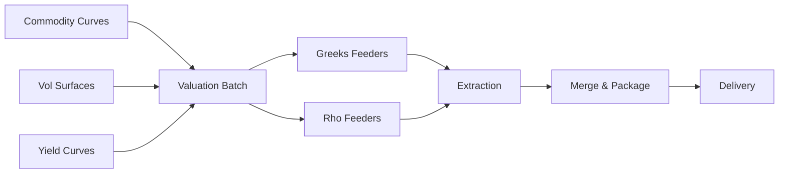

---
# Document Metadata
document_id: EN-BRD-001
document_name: Energy Sensitivities Feed - Business Requirements Document
version: 1.0
effective_date: 2025-01-03
next_review_date: 2026-01-03
owner: Market Risk Technology
approving_committee: Risk Technology Change Board

# Taxonomy Reference
parent_node: L7-Systems/market-risk/feeds
feed_family: Energy Sensitivities
feed_id: EN-001
---

# Energy Sensitivities Feed - Business Requirements Document

**Meridian Global Bank - Market Risk Technology**

| Document Control | |
|-----------------|---|
| **Document ID** | EN-BRD-001 |
| **Version** | 1.0 |
| **Effective Date** | 3 January 2025 |
| **Owner** | Market Risk Technology |
| **Approver** | Risk Technology Change Board |

---

## 1. Executive Summary

### 1.1 Purpose

This Business Requirements Document (BRD) defines the requirements for the Energy Sensitivities feed from Murex (VESPA module) to downstream risk systems. This feed provides **commodity Greeks** (Delta, Gamma, Theta, Vega) and **Rho** (interest rate sensitivity) for energy trading positions.

### 1.2 Scope

| In Scope | Out of Scope |
|----------|--------------|
| Commodity Delta/Adapted Delta | Real-time sensitivity streaming |
| Commodity Gamma | Intraday Greeks updates |
| Commodity Theta (time decay) | Cross-commodity correlations |
| Commodity Vega (volatility) | Commodity VaR calculation |
| Interest rate Rho (DV01) | Non-commodity sensitivities |
| Daily T+1 extraction | Credit sensitivities for energy counterparties |

### 1.3 Business Context

The Energy Sensitivities feed provides risk measures for Meridian Global Bank's **commodities trading desk**, covering:

- **Crude Oil**: Brent, WTI, Dubai
- **Refined Products**: Gasoline, Diesel, Jet Fuel, Heating Oil
- **Natural Gas**: Henry Hub, NBP, TTF
- **LNG**: Spot and term contracts
- **Carbon**: EU ETS, CER
- **Freight**: Dry bulk, tanker routes

Key business applications include:

- **Position Management**: Real-time delta exposure by commodity curve
- **Options Book**: Greeks monitoring for non-linear positions
- **P&L Attribution**: Decomposing P&L into delta, gamma, theta, vega components
- **Risk Limits**: Greeks-based limit monitoring
- **Regulatory Reporting**: FRTB commodity risk charge calculations
- **Hedging**: Delta and vega hedging strategies

---

## 2. Business Requirements

### 2.1 Functional Requirements

#### BR-001: Commodity Greeks Extraction

**Priority**: Critical
**Description**: Extract daily commodity Greeks (Delta, Gamma, Theta, Vega) from Murex VESPA module for all active energy positions.

**Acceptance Criteria**:
- Extract Greeks for all active trades in commodities product families
- Cover both LINEAR (forwards, swaps) and NON-LINEAR (options, Asians) positions
- Capture sensitivities at each tenor pillar point
- Filter by legal entity (MGB)
- Complete extraction by 04:00 GMT T+1

#### BR-002: Delta Sensitivity

**Priority**: Critical
**Description**: Extract Delta sensitivity representing P&L change per unit move in underlying commodity price.

**Acceptance Criteria**:
- Delta in native units (BBL, MT, GAL, etc.)
- Use Adapted Delta for Asian options and options on futures
- Use Standard Delta for linear products
- Cover all commodity curves (crude, products, gas, etc.)
- Link to tenor pillar for term structure

#### BR-003: Gamma Sensitivity

**Priority**: High
**Description**: Extract Gamma sensitivity representing rate of change of Delta.

**Acceptance Criteria**:
- Gamma in USD (converted at zero-day FX spot rate)
- Applicable primarily to non-linear positions
- Bucketed to commodity curve pillars
- Zero for linear positions

#### BR-004: Theta Sensitivity

**Priority**: High
**Description**: Extract Theta sensitivity representing time decay of options positions.

**Acceptance Criteria**:
- Theta in USD (converted at zero-day FX spot rate)
- Daily time decay value
- Applicable to options and Asian positions
- Zero for linear positions without optionality

#### BR-005: Vega Sensitivity

**Priority**: High
**Description**: Extract Vega sensitivity representing P&L change per volatility move.

**Acceptance Criteria**:
- Vega in USD (converted at zero-day FX spot rate)
- Per 1% volatility shift
- Bucketed to volatility surface pillars
- Applicable to all positions with volatility exposure

#### BR-006: Rho Sensitivity (Interest Rate)

**Priority**: High
**Description**: Extract Rho sensitivity representing P&L change per interest rate move.

**Acceptance Criteria**:
- Rho = DV01(zero) × 100
- Per 1bp parallel shift in yield curve
- Bucketed to standard IR pillars (O/N to 30Y)
- Separate from commodity Greeks in source but combined in output

#### BR-007: Regional Processing

**Priority**: High
**Description**: Support regional extraction aligned with market data sets.

**Acceptance Criteria**:
- London (LN): European markets, GMT close
- Hong Kong (HK): Asian markets, HKT close
- New York (NY): Americas markets, EST close
- Singapore (SP): Additional Asian coverage, SGT close

#### BR-008: Product Coverage

**Priority**: Critical
**Description**: Cover all energy commodity product types.

**Acceptance Criteria**:
- Asian options (cleared and OTC)
- Commodity futures
- Commodity forwards
- Options on futures (listed and OTC)
- Simple options and swaptions
- Spot positions
- Commodity swaps (cleared, physical, standard)

### 2.2 Non-Functional Requirements

#### NFR-001: Data Quality

- Field validation per data dictionary
- Greeks sign consistency (buyer vs seller)
- Zero-sensitivity filtering (exclude null sensitivity records)
- Outlier detection for unusual Greeks values

#### NFR-002: Performance

- Complete regional extraction within 90 minutes
- Handle 100,000+ records per region
- File size limit: 150MB per region

#### NFR-003: Availability

- 99.9% availability for daily batch
- Automated retry on transient failures
- Manual re-run capability

---

## 3. Data Requirements

### 3.1 Output Field Summary

| # | Field | Type | Description | Business Use |
|---|-------|------|-------------|--------------|
| 1 | TP_PFOLIO | VarChar | Trading portfolio | Book mapping |
| 2 | XV_INSTR | VarChar | Instrument/Underlying | Position identification |
| 3 | CURVE_NAME | VarChar | Commodity price curve | Curve mapping |
| 4 | XV_CALMAT | VarChar | Tenor pillar | Term structure point |
| 5 | XV_UNIT | VarChar | Quotation unit | Unit conversion |
| 6 | XV_PRICE | Numeric | Commodity price | Valuation reference |
| 7 | TXV_DELTA | Numeric | Delta sensitivity | Position risk |
| 8 | TXV_GAMMA | Numeric | Gamma sensitivity | Convexity risk |
| 9 | TXV_THETA | Numeric | Theta sensitivity | Time decay |
| 10 | TXV_VEGA | Numeric | Vega sensitivity | Volatility risk |
| 11 | TXV_RHO | Numeric | Rho sensitivity | Interest rate risk |
| 12 | XV_CURR | VarChar | Currency | Denomination |
| 13 | SYS_DATE | Date | Extraction date | Audit trail |
| 14 | SYS_TIME | Time | Extraction time | Audit trail |

**Total Fields**: 14

### 3.2 Greek Definitions

| Greek | Definition | Units | Sign Convention |
|-------|------------|-------|-----------------|
| **Delta** | P&L change per 1 unit move in underlying | Native (BBL, MT) | Positive = long, Negative = short |
| **Gamma** | Rate of change of Delta | USD | Always positive for long options |
| **Theta** | P&L change per 1 day passage of time | USD | Typically negative (time decay) |
| **Vega** | P&L change per 1% volatility increase | USD | Positive = long vol, Negative = short vol |
| **Rho** | P&L change per 1bp rate increase | USD × 100 | Positive = benefits from higher rates |

### 3.3 Linear vs Non-Linear Classification

| Classification | Products | Greeks Populated |
|----------------|----------|------------------|
| **LINEAR** | FUT, FWD, SPOT, SWAP | Delta only (Gamma=Theta=Vega=0) |
| **NON-LINEAR** | ASIAN, OFUT, OPT | Full Greeks (Delta, Gamma, Theta, Vega) |

---

## 4. Source System Requirements

### 4.1 Murex VESPA Module

| Component | Requirement |
|-----------|-------------|
| **Valuation Batch** | Complete by 21:00 GMT |
| **Greeks Calculation** | Full analytical Greeks |
| **Volatility Calibration** | Commodity vol surfaces calibrated |
| **Yield Curve Calibration** | Interest rate curves calibrated |

### 4.2 Simulation Views

| View | Purpose |
|------|---------|
| SV_MRGR_GREEKS | Commodity Greeks (Delta, Gamma, Theta, Vega) |
| SV_MRGR_RHO | Interest rate sensitivity (DV01) |

### 4.3 Reference Data

| Source | Data |
|--------|------|
| SB_PF_REP | Portfolio hierarchy (Bookman) |
| SB_TP_REP | Trade parameters |
| SB_TP_BD_REP | Trade body details (financing rates) |

---

## 5. Integration Requirements

### 5.1 Target Systems

| System | Usage | Priority |
|--------|-------|----------|
| Risk Data Warehouse | Central storage, reporting | Critical |
| Plato (Risk Engine) | FRTB commodity risk calculations | High |
| VESPA Reporting | Regulatory reporting | High |
| Trading Dashboard | Position monitoring | Medium |
| P&L Attribution | Greeks-based P&L decomposition | Medium |

### 5.2 File Delivery

| Property | Specification |
|----------|---------------|
| **Protocol** | SFTP |
| **Format** | CSV (semicolon delimited) |
| **Encoding** | UTF-8 |
| **Packaging** | ZIP (MxMGB_MR_Energy_Sens_{Region}_{YYYYMMDD}.zip) |
| **Delivery Time** | 05:30 GMT |
| **MFT ID** | MurexMGBMrgrnliToVespa |

---

## 6. Business Rules

### 6.1 Delta Selection

| Condition | Delta Source |
|-----------|--------------|
| GROUP in ('ASIAN', 'OFUT') | M_ADAPTED_D (Adapted Delta) |
| All other groups | M_DELTA (Standard Delta) |

**Rationale**: Asian options and options on futures use Adapted Delta which accounts for volatility smile effects.

### 6.2 Instrument Naming

#### Standard Instruments
Use M_PL_INSTRU (PL Instrument) from simulation view.

#### RREPO Deals
| Typology | Naming Rule |
|----------|-------------|
| COM - RREPO FIXED | Underlying + '_FIN' |
| COM - RREPO FV | Underlying + '_FV' |
| COM - RREPO VV | Underlying + '_VV' |

#### Carbon Positions
| Condition | Naming Rule |
|-----------|-------------|
| CER% and not LIVE | 'CER' |
| CER_PROJ% and Theta = 0 | 'CERPJ_' + Project Name |

### 6.3 Price Handling

| Product Type | Price Source |
|--------------|--------------|
| FREIGHT | M_MARKET_PR (market price) |
| GAL unit | M_PRICE × 100 |
| Financed (_FIN) | M_TP_RTVLC02 or M_TP_RTVLC12 |
| All others | M_PRICE |
| Rho records | 0 (not applicable) |

### 6.4 Zero Sensitivity Filtering

Records are excluded if ALL sensitivities are zero:
```sql
HAVING sum(TXV_DELTA) <> 0
    OR sum(TXV_GAMMA) <> 0
    OR sum(TXV_VEGA) <> 0
    OR sum(TXV_THETA) <> 0
    OR sum(TXV_RHO) <> 0
```

---

## 7. Processing Schedule

### 7.1 Daily Timeline

| Time (GMT) | Event |
|------------|-------|
| 18:00 | Commodity curve calibration complete |
| 18:00 | Volatility surface calibration complete |
| 21:00 | Valuation batch complete |
| 03:00 | Greeks feeder batch start |
| 03:30 | Rho feeder batch start |
| 04:00 | Extraction batch start |
| 04:30 | Extraction complete |
| 05:00 | File merge and packaging |
| 05:30 | Delivery |

### 7.2 Dependencies



---

## 8. Acceptance Criteria

### 8.1 UAT Requirements

| Test Case | Expected Result |
|-----------|-----------------|
| Linear product extraction | Delta populated, other Greeks = 0 |
| Non-linear product extraction | All Greeks populated for options |
| Rho extraction | DV01 × 100, Greeks = 0 |
| RREPO deal naming | Correct suffix (_FIN, _FV, _VV) |
| Regional files | Separate files per region |
| File format | 14 fields, semicolon delimiter, UTF-8 |
| Zero filtering | No records with all-zero sensitivities |

### 8.2 Go-Live Criteria

- [ ] All UAT test cases passed
- [ ] Reconciliation to source views complete
- [ ] Downstream systems confirmed receipt
- [ ] Greeks sign validation complete
- [ ] Operational runbook approved
- [ ] Alerting configured

---

## 9. Related Documents

| Document | ID | Relationship |
|----------|-----|-------------|
| [Energy Sensitivities Overview](./energy-sensitivities-overview.md) | EN-OVW-001 | Parent document |
| [Energy Sensitivities IT Config](./energy-sensitivities-config.md) | EN-CFG-001 | Technical configuration |
| [Energy Sensitivities IDD](./energy-sensitivities-idd.md) | EN-IDD-001 | Interface design |
| [Feeds Overview](../feeds-overview.md) | MR-L7-003 | Feed family parent |
| [Data Dictionary](../../data-dictionary.md) | MR-L7-002 | Field definitions |

---

## 10. Document Control

### 10.1 Version History

| Version | Date | Change | Author |
|---------|------|--------|--------|
| 1.0 | 2025-01-03 | Initial version | Risk Technology |

### 10.2 Approval

| Role | Name | Date |
|------|------|------|
| Business Owner | Head of Commodities Trading | |
| Technical Owner | Head of Risk Technology | |
| Approver | Risk Technology Change Board | |

---

*End of Document*
