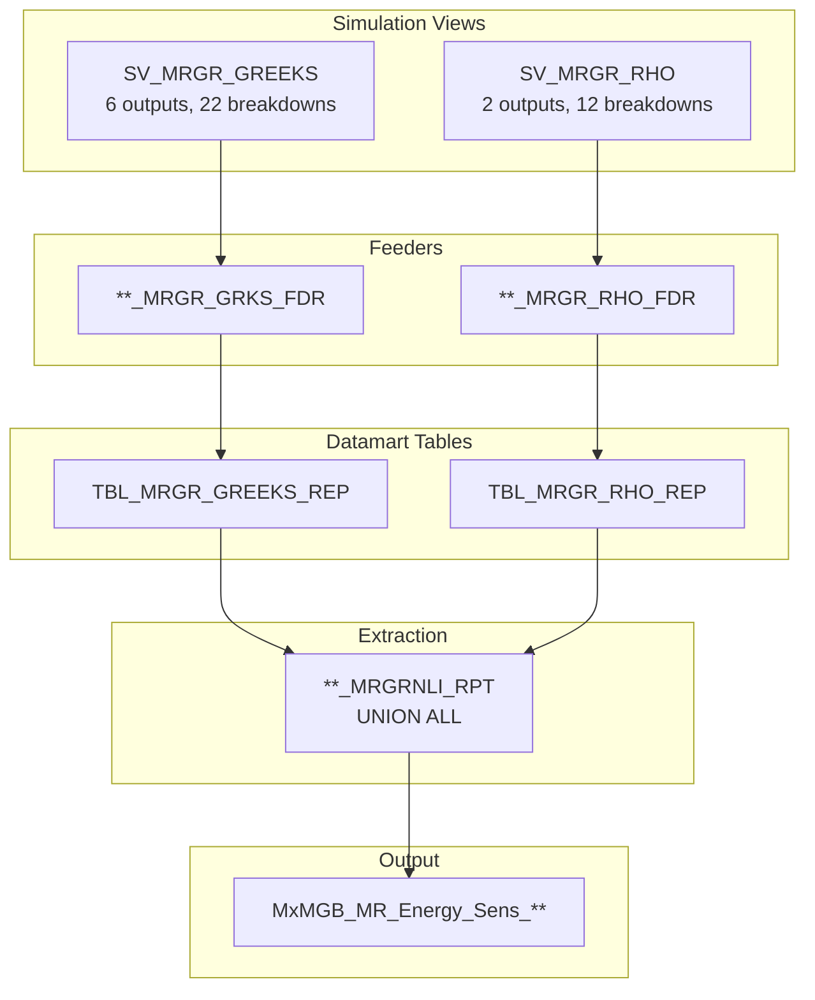
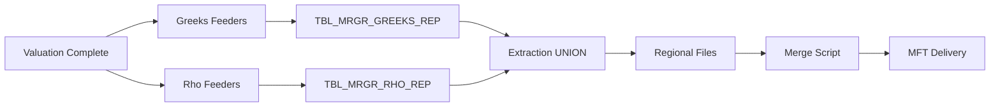

---
# Document Metadata
document_id: EN-OVW-001
document_name: Energy Sensitivities - Overview
version: 1.0
effective_date: 2025-01-03
next_review_date: 2026-01-03
owner: Market Risk Technology
approving_committee: Risk Technology Change Board

# Taxonomy Reference
parent_node: L7-Systems/market-risk/feeds
feed_family: Energy Sensitivities
---

# Energy Sensitivities - Overview

**Meridian Global Bank - Market Risk Technology**

| Document Control | |
|-----------------|---|
| **Document ID** | EN-OVW-001 |
| **Version** | 1.0 |
| **Effective Date** | 3 January 2025 |
| **Owner** | Market Risk Technology |
| **Approver** | Risk Technology Change Board |

---

## 1. Introduction

### 1.1 Purpose

This document provides an overview of the Energy Sensitivities feed suite from Murex to downstream risk systems. It serves as the parent document for the Energy sensitivity feed documentation, describing the overall architecture, data flow, and relationships between components.

### 1.2 Scope

The Energy Sensitivities suite provides market risk exposures and their associated sensitivities for **commodities risk factors** arising from Energy trading activity executed in Murex. Unlike Credit Sensitivities (8 feeds) or Interest Rate Sensitivities, Energy Sensitivities are consolidated into a **single combined feed** that includes both Greeks and Rho sensitivities.

### 1.3 Feed Family Overview

| Property | Value |
|----------|-------|
| **Feed Family** | Energy Sensitivities |
| **Number of Feeds** | 1 (combined Greeks + Rho) |
| **Source System** | Murex (VESPA Module) |
| **Target Systems** | Risk Data Warehouse, Plato, VESPA Reporting |
| **Frequency** | Daily (T+1) |
| **Regions** | London (LN), Hong Kong (HK), New York (NY), Singapore (SP) |

---

## 2. Feed Architecture

### 2.1 Single Feed Structure

Unlike other sensitivity suites that generate multiple feeds, Energy Sensitivities uses a **consolidated approach**:

```
Energy Sensitivities Feed
├── Greeks Component (from SV_MRGR_GREEKS)
│   ├── Price
│   ├── Delta / Adapted Delta
│   ├── Gamma
│   ├── Theta
│   └── Vega
└── Rho Component (from SV_MRGR_RHO)
    ├── Yield Zero Rate
    └── DV01 (Zero) × 100
```

### 2.2 Output Feed

| Feed Name | File Pattern | Description |
|-----------|--------------|-------------|
| Energy Sensitivities | `MxMGB_MR_Energy_Sens_{Region}_{YYYYMMDD}.csv` | Combined Greeks and Rho sensitivities |

### 2.3 Data Flow Architecture



---

## 3. Simulation Views

### 3.1 SV_MRGR_GREEKS

The Greeks simulation view calculates commodity price sensitivities.

| Property | Value |
|----------|-------|
| **View Name** | SV_MRGR_GREEKS |
| **Outputs** | 6 |
| **Breakdowns** | 22 |
| **Dynamic Table** | VW_MRGR_GREEKS |
| **Datamart Table** | TBL_MRGR_GREEKS_REP |

#### Outputs

| Output | Dictionary Path | Description |
|--------|-----------------|-------------|
| Price | RiskEngine.Results.Outputs.Commodities.Curve Risk.Delta.Price | Price for the related commodity contract |
| Delta | RiskEngine.Results.Outputs.Commodities.Curve Risk.Delta.Value | Commodity Delta in native unit (BBL, MT) |
| Adapted Delta | RiskEngine.Results.Outputs.Commodities.Curve Risk.Adapted delta.Value | Delta with volatility surface shift |
| Gamma | RiskEngine.Results.Outputs.Commodities.Curve Risk.Gamma.Value | Sensitivity to underlying volatility (USD) |
| Theta | RiskEngine.Results.Outputs.Commodities.Curve Risk.Theta.Value | Time decay sensitivity (USD) |
| Vega | RiskEngine.Results.Outputs.Commodities.Curve Risk.Vega.Value | Volatility sensitivity (USD) |

#### Key Breakdowns

| Breakdown | Dictionary Path | Description |
|-----------|-----------------|-------------|
| Index (label) | Formulas.Index.Label | Label of the commodity index |
| Product (label) | Formulas.Product.Label | Label of the commodity product |
| Pillar (label) | Formulas.Pillar.Label | Pillar in commodity price curve |
| PILLARS | Formulas.PILLARS | Pillar label (alternative) |
| Curve name | Formulas.Curve name | Commodity price curve label |
| Unit | Formulas.Index.Quotation.Unit | Quotation unit (BBL, MT, GAL) |

### 3.2 SV_MRGR_RHO

The Rho simulation view calculates interest rate sensitivities for energy positions.

| Property | Value |
|----------|-------|
| **View Name** | SV_MRGR_RHO |
| **Outputs** | 2 |
| **Breakdowns** | 12 |
| **Dynamic Table** | VW_MRGR_RHO |
| **Datamart Table** | TBL_MRGR_RHO_REP |

#### Outputs

| Output | Dictionary Path | Description |
|--------|-----------------|-------------|
| Yield zero rate | RiskEngine.Results.Outputs.Interest rates.Delta.Zero.Rate | Zero coupon rate for yield curve |
| DV01 (zero) | RiskEngine.Results.Outputs.Interest rates.Delta.Zero.Value | IR Delta per 1bp parallel shift |

#### Key Breakdowns

| Breakdown | Dictionary Path | Description |
|-----------|-----------------|-------------|
| Curve name | RiskEngine.Results.Outputs.Interest rates.Delta.Zero.Curve key.Curve name | Interest rate curve label |
| Date | RiskEngine.Results.Outputs.Interest rates.Delta.Zero.Date | Pillar date from maturity set |

#### Maturity Set: SV_MRGR_IR

The Rho calculation uses maturity set SV_MRGR_IR with pillars:
- O/N, T/N, 1W, 2W
- 1M, 2M, 3M, 4M, 5M, 6M, 7M, 8M, 9M, 10M, 11M
- 1Y, 2Y, 3Y, 4Y, 5Y, 7Y, 10Y, 15Y, 20Y, 25Y, 30Y

---

## 4. Product Scope

### 4.1 Commodity Product Types

The Energy Sensitivities feed covers the following Family/Group/Type combinations:

| Family | Group | Type | Description |
|--------|-------|------|-------------|
| COM | ASIAN | (blank) | Asian options |
| COM | ASIAN | CLR | Cleared Asian options |
| COM | FUT | (blank) | Futures |
| COM | FWD | (blank) | Forwards |
| COM | OFUT | LST | Listed options on futures |
| COM | OFUT | OTC | OTC options on futures |
| COM | OPT | SMP | Simple options |
| COM | OPT | SWAP | Swaptions |
| COM | SPOT | (blank) | Spot positions |
| COM | SWAP | (blank) | Swaps |
| COM | SWAP | CLR | Cleared swaps |
| COM | SWAP | PHYS | Physical swaps |

### 4.2 Risk Type Classification

Positions are classified as LINEAR or NON-LINEAR based on product type:

| Risk Type | Products | Characteristics |
|-----------|----------|-----------------|
| **LINEAR** | FUT, FWD, SPOT, SWAP | Delta only, no optionality |
| **NON-LINEAR** | ASIAN, OFUT, OPT | Full Greeks (Delta, Gamma, Theta, Vega) |

The @RiskType parameter in extraction filters output:
- `NON-LINEAR`: For MxMGB_MR_Energy_Sens feed (primary feed)
- `LINEAR`: For alternative linear-only reporting

---

## 5. Regional Processing

### 5.1 Market Data Sets

| Region | Market Data Set | Close Time |
|--------|-----------------|------------|
| London (LN) | MGB_LN_EOD | GMT close |
| Hong Kong (HK) | MGB_HK_EOD | HKT close |
| New York (NY) | MGB_NY_EOD | EST close |
| Singapore (SP) | MGB_SP_EOD | SGT close |

### 5.2 Portfolio Nodes by Region

#### Greeks Feeders

| Region | Portfolio Nodes |
|--------|-----------------|
| HK | LMHK, PMSG |
| LN | FXDLN, IRLN, LMLN, PMLN |
| NY | LMNY |
| SP | LMSP |

**Note**: PMNY and PMSG are excluded from Greeks feeders.

#### Rho Feeders

| Region | Portfolio Nodes |
|--------|-----------------|
| HK | LMHK, PMSG |
| LN | FXDLN, IRLN, LMLN, PMLN |
| NY | LMNY, PMNY |
| SP | LMSP |

**Note**: PMNY and PMSG are included in Rho feeders (differs from Greeks).

---

## 6. Special Handling

### 6.1 RREPO Deal Instrument Naming

Commodity Repurchase (RREPO) deals require special instrument naming logic:

| Typology | Instrument Suffix | Example |
|----------|-------------------|---------|
| COM - RREPO FIXED | _FIN | BRENT_FIN |
| COM - RREPO FV | _FV | BRENT_FV |
| COM - RREPO VV | _VV | BRENT_VV |

For live deals: Uses M_TP_CMULAB0 (Commodity underlying) from SB_TP_REP
For purged deals: Uses M_UNDERLYIN from simulation view

### 6.2 CER (Carbon Emission Rights) Handling

| Condition | Instrument |
|-----------|------------|
| CER% and not LIVE | 'CER' |
| CER_PROJ% and Theta = 0 | 'CERPJ_' + Project Name |

### 6.3 Price Handling

| Condition | Price Source |
|-----------|--------------|
| FREIGHT products | M_MARKET_PR (market price) |
| GAL unit | M_PRICE × 100 |
| Financed deals (_FIN) | M_TP_RTVLC02 or M_TP_RTVLC12 from SB_TP_BD_REP |
| All others | M_PRICE from simulation view |
| Rho records | 0 |

### 6.4 Delta Selection

| Product Group | Delta Used |
|---------------|------------|
| ASIAN, OFUT | M_ADAPTED_D (Adapted Delta) |
| All others | M_DELTA (Standard Delta) |

---

## 7. Output Structure

### 7.1 Output Fields (14 Fields)

| # | Field | Type | Length | Description |
|---|-------|------|--------|-------------|
| 1 | TP_PFOLIO | VarChar | - | Trading portfolio |
| 2 | XV_INSTR | VarChar | 35 | Instrument name |
| 3 | CURVE_NAME | VarChar | 30 | Commodity price curve |
| 4 | XV_CALMAT | VarChar | 10 | Pillar/tenor |
| 5 | XV_UNIT | VarChar | 21 | Quotation unit |
| 6 | XV_PRICE | Numeric | 20,6 | Commodity price |
| 7 | TXV_DELTA | Numeric | 15,6 | Delta sensitivity |
| 8 | TXV_GAMMA | Numeric | 15,6 | Gamma sensitivity |
| 9 | TXV_THETA | Numeric | 15,6 | Theta sensitivity |
| 10 | TXV_VEGA | Numeric | 15,6 | Vega sensitivity |
| 11 | TXV_RHO | Numeric | 16,4 | Rho sensitivity (DV01×100) |
| 12 | XV_CURR | VarChar | 16 | Currency |
| 13 | SYS_DATE | Date | - | System date |
| 14 | SYS_TIME | Time | - | System time |

### 7.2 Greeks vs Rho Records

| Field | Greeks Records | Rho Records |
|-------|----------------|-------------|
| XV_INSTR | Instrument/Underlying | Currency |
| CURVE_NAME | Commodity curve | (blank) |
| XV_UNIT | Unit (BBL, MT, GAL) | (blank) |
| XV_PRICE | Price value | 0 |
| TXV_DELTA | Delta value | 0 |
| TXV_GAMMA | Gamma value | 0 |
| TXV_THETA | Theta value | 0 |
| TXV_VEGA | Vega value | 0 |
| TXV_RHO | 0 | DV01 × 100 |
| XV_CURR | Currency | (blank) |

---

## 8. Processing Schedule

### 8.1 Daily Timeline (GMT)

| Time | Event |
|------|-------|
| 18:00 | Market data close (LN) |
| 21:00 | Valuation batch complete |
| 03:00 | Greeks feeder batch start |
| 03:30 | Rho feeder batch start |
| 04:00 | Extraction batch start |
| 04:30 | Extraction complete |
| 05:00 | File merge (merge_files.sh) |
| 05:30 | Delivery via MFT |

### 8.2 Processing Flow



---

## 9. Feed Documentation Index

| Document | ID | Description |
|----------|-----|-------------|
| [Energy Sensitivities BRD](./energy-sensitivities-brd.md) | EN-BRD-001 | Business requirements |
| [Energy Sensitivities IT Config](./energy-sensitivities-config.md) | EN-CFG-001 | Murex GOM configuration |
| [Energy Sensitivities IDD](./energy-sensitivities-idd.md) | EN-IDD-001 | Interface design |

---

## 10. Comparison with Other Sensitivity Feeds

| Aspect | Energy | Credit | Interest Rate |
|--------|--------|--------|---------------|
| Number of Feeds | 1 | 8 | TBD |
| Structure | Combined (UNION) | Separate feeds | TBD |
| Greeks | Delta, Gamma, Theta, Vega | N/A | N/A |
| Spread Sensitivity | N/A | CS01 (Zero/Par) | N/A |
| IR Sensitivity | Rho (DV01×100) | N/A | DV01 |
| Recovery Sensitivity | N/A | RR01, RR02 | N/A |
| File Prefix | MxMGB_MR_Energy_Sens | MxMGB_MR_Credit_* | MxMGB_MR_Rates_* |

---

## 11. Related Documents

| Document | ID | Relationship |
|----------|-----|-------------|
| [Feeds Overview](../feeds-overview.md) | MR-L7-003 | Parent document |
| [Data Dictionary](../../data-dictionary.md) | MR-L7-002 | Field definitions |
| [CR Sensitivities Overview](../cr-sensitivities-overview.md) | CR-OVW-001 | Related suite |

---

## 12. Document Control

### 12.1 Version History

| Version | Date | Change | Author |
|---------|------|--------|--------|
| 1.0 | 2025-01-03 | Initial version | Risk Technology |

### 12.2 Approval

| Role | Name | Date |
|------|------|------|
| Business Owner | Head of Commodities Trading | |
| Technical Owner | Head of Risk Technology | |
| Approver | Risk Technology Change Board | |

---

*End of Document*
