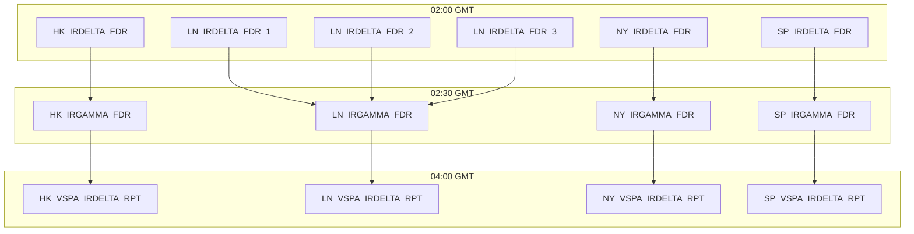

---
# Document Metadata
document_id: IR-CFG-001
document_name: IR Delta & Gamma - IT Configuration
version: 1.0
effective_date: 2025-01-03
next_review_date: 2026-01-03
owner: Market Risk Technology
approving_committee: Risk Technology Change Board

# Taxonomy Reference
parent_node: L7-Systems/market-risk/feeds/ir-delta-gamma
feed_family: IR Delta & Gamma
document_type: Config
---

# IR Delta & Gamma - IT Configuration

**Meridian Global Bank - Market Risk Technology**

| Document Control | |
|-----------------|---|
| **Document ID** | IR-CFG-001 |
| **Version** | 1.0 |
| **Effective Date** | 3 January 2025 |
| **Owner** | Market Risk Technology |
| **Approver** | Risk Technology Change Board |

---

## 1. Introduction

### 1.1 Purpose

This document details the Murex GOM (Generic Object Management) configuration for the IR Delta & Gamma sensitivity feed. It provides the technical specifications required to configure, maintain, and troubleshoot the feed components within Murex.

### 1.2 Scope

This configuration covers:
- Simulation View definitions (IRPV01_DELTAS, IRPV02_GAMMAS)
- Feeder configurations (Delta and Gamma feeders)
- Datamart table structures
- Data Extractor configuration
- Extraction Request setup
- Regional processing parameters

---

## 2. Component Overview

### 2.1 Architecture Diagram

```
┌─────────────────────────────────────────────────────────────────────────────┐
│                          IR DELTA & GAMMA FEED                              │
├─────────────────────────────────────────────────────────────────────────────┤
│                                                                             │
│  ┌──────────────────────┐      ┌──────────────────────┐                     │
│  │   IRPV01_DELTAS      │      │   IRPV02_GAMMAS      │                     │
│  │   Simulation View    │      │   Simulation View    │                     │
│  │   4 outputs          │      │   6 outputs          │                     │
│  │   13 breakdowns      │      │   15 breakdowns      │                     │
│  └──────────┬───────────┘      └──────────┬───────────┘                     │
│             │                             │                                 │
│             ▼                             ▼                                 │
│  ┌──────────────────────┐      ┌──────────────────────┐                     │
│  │   **_IRDELTA_FDR     │      │   **_IRGAMMA_FDR     │                     │
│  │   Feeders            │      │   Feeders            │                     │
│  │   HK/LN/NY/SP        │      │   HK/LN/NY/SP        │                     │
│  └──────────┬───────────┘      └──────────┬───────────┘                     │
│             │                             │                                 │
│             ▼                             ▼                                 │
│  ┌──────────────────────┐      ┌──────────────────────┐                     │
│  │   A_IRPV01_DELTA.REP │      │   A_IRPV02_GAMMA.REP │                     │
│  │   Datamart Table     │      │   Datamart Table     │                     │
│  └──────────┬───────────┘      └──────────┬───────────┘                     │
│             │                             │                                 │
│             └──────────────┬──────────────┘                                 │
│                            │                                                │
│                            ▼                                                │
│             ┌──────────────────────────────┐                                │
│             │   DE_IRD_PV01DELTA           │                                │
│             │   Data Extractor             │                                │
│             │   (LEFT JOIN)                │                                │
│             └──────────────┬───────────────┘                                │
│                            │                                                │
│                            ▼                                                │
│             ┌──────────────────────────────┐                                │
│             │   IRPV01_Delta_ZAR           │                                │
│             │   Extraction Request         │                                │
│             └──────────────┬───────────────┘                                │
│                            │                                                │
│                            ▼                                                │
│             ┌──────────────────────────────┐                                │
│             │   MxMGB_MR_Rates_DV01_**     │                                │
│             │   Output File                │                                │
│             └──────────────────────────────┘                                │
│                                                                             │
└─────────────────────────────────────────────────────────────────────────────┘
```

### 2.2 Component Summary

| Component Type | Name | Description |
|---------------|------|-------------|
| Simulation View | IRPV01_DELTAS | Delta (DV01) calculation |
| Simulation View | IRPV02_GAMMAS | Gamma calculation |
| Feeder | **_IRDELTA_FDR | Delta feeder (per region) |
| Feeder | **_IRGAMMA_FDR | Gamma feeder (per region) |
| Datamart Table | A_IRPV01_DELTA.REP | Delta results storage |
| Datamart Table | A_IRPV02_GAMMA.REP | Gamma results storage |
| Data Extractor | DE_IRD_PV01DELTA | Combined extraction |
| Extraction Request | IRPV01_Delta_ZAR | Output file generation |

---

## 3. Simulation Views

### 3.1 IRPV01_DELTAS

#### 3.1.1 View Properties

| Property | Value |
|----------|-------|
| **View Name** | IRPV01_DELTAS |
| **View Type** | Dynamic |
| **Dynamic Table** | VW_IRPV01_DELTA |
| **Base Template** | IR_DELTA_BASE |
| **Calculation Engine** | Standard Valuation |

#### 3.1.2 Outputs Configuration

| # | Output Name | Dictionary Path | Type | Precision |
|---|-------------|-----------------|------|-----------|
| 1 | DV01_ZERO | RiskEngine.Results.Outputs.Interest rates.Delta.Zero.Value | Numeric | 4 |
| 2 | DV01_USD | RiskEngine.Results.Outputs.Interest rates.Delta.Zero.Value USD | Numeric | 4 |
| 3 | DV01_ZAR | RiskEngine.Results.Outputs.Interest rates.Delta.Zero.Value ZAR | Numeric | 4 |
| 4 | DV01_PAR_ZAR | RiskEngine.Results.Outputs.Interest rates.Delta.Par.Value ZAR | Numeric | 4 |

**Note**: Outputs 3 and 4 (ZAR-related) are deprecated but retained for backward compatibility.

#### 3.1.3 Breakdowns Configuration

| # | Breakdown Name | Dictionary Path | Type |
|---|----------------|-----------------|------|
| 1 | M_NB | Data.Trade.Trade number | String |
| 2 | M_TP_PFOLIO | Data.Trade.Portfolio | String |
| 3 | M_DATE | RiskEngine.Results.Outputs.Interest rates.Delta.Zero.Date | Date |
| 4 | M_CURVENAME | RiskEngine.Results.Outputs.Interest rates.Delta.Zero.Curve key.Curve name | String |
| 5 | M_TRN_FMLY | Data.Trade.Typology.Family | String |
| 6 | M_TRN_GRP | Data.Trade.Typology.Group | String |
| 7 | M_TRN_TYPE | Data.Trade.Typology.Type | String |
| 8 | M_TRN_STYP | Data.Trade.Typology.Subtype | String |
| 9 | M_CATEGORY | Data.Trade.Category | String |
| 10 | M_ISSUE | Data.Trade.Issue | String |
| 11 | M_PROFITCTR | Data.Trade.Profit centre | String |
| 12 | M_ENTITY | Data.Trade.Entity | String |
| 13 | M_CCY | Data.Trade.Currency | String |

#### 3.1.4 Maturity Set Configuration

| Property | Value |
|----------|-------|
| **Maturity Set Name** | LNOFFICIAL |
| **Reference Curve** | Interest rates.Delta.Zero |
| **Interpolation** | Linear |

**Pillar Definition:**

| Tenor | Days | Label |
|-------|------|-------|
| O/N | 1 | O/N |
| T/N | 2 | T/N |
| 1W | 7 | 1W |
| 2W | 14 | 2W |
| 1M | 30 | 1M |
| 2M | 60 | 2M |
| 3M | 90 | 3M |
| 6M | 180 | 6M |
| 9M | 270 | 9M |
| 1Y | 365 | 1Y |
| 2Y | 730 | 2Y |
| 3Y | 1095 | 3Y |
| 5Y | 1825 | 5Y |
| 7Y | 2555 | 7Y |
| 10Y | 3650 | 10Y |
| 15Y | 5475 | 15Y |
| 20Y | 7300 | 20Y |
| 30Y | 10950 | 30Y |

### 3.2 IRPV02_GAMMAS

#### 3.2.1 View Properties

| Property | Value |
|----------|-------|
| **View Name** | IRPV02_GAMMAS |
| **View Type** | Dynamic |
| **Dynamic Table** | VW_IRPV02_GAMMA |
| **Base Template** | IR_GAMMA_BASE |
| **Calculation Engine** | Standard Valuation |

#### 3.2.2 Outputs Configuration

| # | Output Name | Dictionary Path | Type | Precision |
|---|-------------|-----------------|------|-----------|
| 1 | GAMMA_ZERO_CCY | RiskEngine.Results.Outputs.Interest rates.Gamma.Zero.Value | Numeric | 4 |
| 2 | GAMMA_ZERO_USD | RiskEngine.Results.Outputs.Interest rates.Gamma.Zero.Value USD | Numeric | 4 |
| 3 | GAMMA_ZERO_ZAR | RiskEngine.Results.Outputs.Interest rates.Gamma.Zero.Value ZAR | Numeric | 4 |
| 4 | GAMMA_PAR_CCY | RiskEngine.Results.Outputs.Interest rates.Gamma.Par.Value | Numeric | 4 |
| 5 | GAMMA_PAR_USD | RiskEngine.Results.Outputs.Interest rates.Gamma.Par.Value USD | Numeric | 4 |
| 6 | GAMMA_PAR_ZAR | RiskEngine.Results.Outputs.Interest rates.Gamma.Par.Value ZAR | Numeric | 4 |

**Note**: Outputs 3 and 6 (ZAR-related) are deprecated but retained for backward compatibility.

#### 3.2.3 Breakdowns Configuration

| # | Breakdown Name | Dictionary Path | Type |
|---|----------------|-----------------|------|
| 1 | M_NB | Data.Trade.Trade number | String |
| 2 | M_TP_PFOLIO | Data.Trade.Portfolio | String |
| 3 | M_DATE | RiskEngine.Results.Outputs.Interest rates.Gamma.Zero.Date | Date |
| 4 | M_CURVENAME | RiskEngine.Results.Outputs.Interest rates.Gamma.Zero.Curve key.Curve name | String |
| 5 | M_TRN_FMLY | Data.Trade.Typology.Family | String |
| 6 | M_TRN_GRP | Data.Trade.Typology.Group | String |
| 7 | M_TRN_TYPE | Data.Trade.Typology.Type | String |
| 8 | M_TRN_STYP | Data.Trade.Typology.Subtype | String |
| 9 | M_CATEGORY | Data.Trade.Category | String |
| 10 | M_ISSUE | Data.Trade.Issue | String |
| 11 | M_PROFITCTR | Data.Trade.Profit centre | String |
| 12 | M_ENTITY | Data.Trade.Entity | String |
| 13 | M_CCY | Data.Trade.Currency | String |
| 14 | M_OPT_STYLE | Data.Trade.Option style | String |
| 15 | M_OPT_TYPE | Data.Trade.Option type | String |

#### 3.2.4 Product Filter

The Gamma simulation view includes a product filter to restrict calculation to option products:

```sql
WHERE M_TRN_FMLY = 'IRD'
AND (M_TRN_GRP = 'CF' OR M_TRN_GRP = 'OSWP')
```

| Product | Description | Gamma Calculated |
|---------|-------------|------------------|
| IRD\|CF\|* | Caps and Floors | Yes |
| IRD\|OSWP\|* | Swaptions | Yes |
| IRD\|SWAP\|* | Interest Rate Swaps | No |
| IRD\|FRA\|* | Forward Rate Agreements | No |
| IRD\|FUT\|* | Futures | No |
| IRD\|BOND\|* | Bonds | No |
| IRD\|REPO\|* | Repos | No |

---

## 4. Feeders

### 4.1 Delta Feeders

#### 4.1.1 Feeder Configuration

| Region | Feeder Name | Simulation View | Portfolio Filter |
|--------|-------------|-----------------|------------------|
| HK | HK_IRDELTA_FDR | IRPV01_DELTAS | IRDLN, IRDHK |
| LN | LN_IRDELTA_FDR_1 | IRPV01_DELTAS | IRDLN (Batch 1) |
| LN | LN_IRDELTA_FDR_2 | IRPV01_DELTAS | IRDLN (Batch 2) |
| LN | LN_IRDELTA_FDR_3 | IRPV01_DELTAS | IRDLN (Batch 3) |
| NY | NY_IRDELTA_FDR | IRPV01_DELTAS | IRDNY |
| SP | SP_IRDELTA_FDR | IRPV01_DELTAS | IRDSP |

**Note**: London uses 3 separate batches for historical performance optimization.

#### 4.1.2 Feeder Parameters

| Parameter | Value | Description |
|-----------|-------|-------------|
| Mode | REPLACE | Full refresh each run |
| Target Table | A_IRPV01_DELTA.REP | Datamart table |
| Batch Size | 10000 | Records per commit |
| Timeout | 3600 | Seconds |
| Retry Count | 3 | Number of retries |
| Parallel Threads | 4 | Processing threads |

#### 4.1.3 Market Data Assignment

| Region | Market Data Set | As Of Date |
|--------|-----------------|------------|
| HK | MGB_HK_EOD | T (COB) |
| LN | MGB_LN_EOD | T (COB) |
| NY | MGB_NY_EOD | T (COB) |
| SP | MGB_SP_EOD | T (COB) |

### 4.2 Gamma Feeders

#### 4.2.1 Feeder Configuration

| Region | Feeder Name | Simulation View | Portfolio Filter |
|--------|-------------|-----------------|------------------|
| HK | HK_IRGAMMA_FDR | IRPV02_GAMMAS | IRDLN, IRDHK |
| LN | LN_IRGAMMA_FDR | IRPV02_GAMMAS | IRDLN |
| NY | NY_IRGAMMA_FDR | IRPV02_GAMMAS | IRDNY |
| SP | SP_IRGAMMA_FDR | IRPV02_GAMMAS | IRDSP |

#### 4.2.2 Feeder Parameters

| Parameter | Value | Description |
|-----------|-------|-------------|
| Mode | REPLACE | Full refresh each run |
| Target Table | A_IRPV02_GAMMA.REP | Datamart table |
| Batch Size | 5000 | Records per commit |
| Timeout | 1800 | Seconds (smaller scope) |
| Retry Count | 3 | Number of retries |
| Parallel Threads | 2 | Processing threads |

#### 4.2.3 Product Filter Applied

```sql
WHERE M_TRN_FMLY || '|' || M_TRN_GRP || '|' IN ('IRD|CF|', 'IRD|OSWP|')
```

---

## 5. Datamart Tables

### 5.1 A_IRPV01_DELTA.REP

#### 5.1.1 Table Structure

| # | Column | Type | Length | Nullable | Description |
|---|--------|------|--------|----------|-------------|
| 1 | M_NB | VARCHAR | 20 | NO | Trade number (PK) |
| 2 | M_TP_PFOLIO | VARCHAR | 30 | NO | Portfolio |
| 3 | M_DATE | DATE | - | NO | Pillar date (PK) |
| 4 | M_CURVENAME | VARCHAR | 50 | NO | Curve name (PK) |
| 5 | M_TRN_FMLY | VARCHAR | 10 | YES | Trade family |
| 6 | M_TRN_GRP | VARCHAR | 10 | YES | Trade group |
| 7 | M_TRN_TYPE | VARCHAR | 10 | YES | Trade type |
| 8 | M_TRN_STYP | VARCHAR | 10 | YES | Trade subtype |
| 9 | M_CATEGORY | VARCHAR | 20 | YES | Category |
| 10 | M_ISSUE | VARCHAR | 50 | YES | Issue |
| 11 | M_PROFITCTR | VARCHAR | 20 | YES | Profit centre |
| 12 | M_ENTITY | VARCHAR | 20 | YES | Entity |
| 13 | M_CCY | VARCHAR | 3 | YES | Currency |
| 14 | M_DV01_ZERO | NUMBER | 18,4 | YES | DV01 local CCY |
| 15 | M_DV01_USD | NUMBER | 18,4 | YES | DV01 USD |
| 16 | M_DV01_ZAR | NUMBER | 18,4 | YES | DV01 ZAR (deprecated) |
| 17 | M_DV01_PAR_ZAR | NUMBER | 18,4 | YES | DV01 Par ZAR (deprecated) |
| 18 | M_TIMESTAMP | TIMESTAMP | - | NO | Record timestamp |
| 19 | M_REGION | VARCHAR | 2 | NO | Processing region |

#### 5.1.2 Indexes

| Index Name | Columns | Type |
|------------|---------|------|
| PK_IRPV01_DELTA | M_NB, M_DATE, M_CURVENAME | Primary Key |
| IX_IRPV01_PFOLIO | M_TP_PFOLIO | Non-unique |
| IX_IRPV01_DATE | M_DATE | Non-unique |
| IX_IRPV01_REGION | M_REGION, M_TIMESTAMP | Non-unique |

### 5.2 A_IRPV02_GAMMA.REP

#### 5.2.1 Table Structure

| # | Column | Type | Length | Nullable | Description |
|---|--------|------|--------|----------|-------------|
| 1 | M_NB | VARCHAR | 20 | NO | Trade number (PK) |
| 2 | M_TP_PFOLIO | VARCHAR | 30 | NO | Portfolio |
| 3 | M_DATE | DATE | - | NO | Pillar date (PK) |
| 4 | M_CURVENAME | VARCHAR | 50 | NO | Curve name (PK) |
| 5 | M_TRN_FMLY | VARCHAR | 10 | YES | Trade family |
| 6 | M_TRN_GRP | VARCHAR | 10 | YES | Trade group |
| 7 | M_TRN_TYPE | VARCHAR | 10 | YES | Trade type |
| 8 | M_TRN_STYP | VARCHAR | 10 | YES | Trade subtype |
| 9 | M_CATEGORY | VARCHAR | 20 | YES | Category |
| 10 | M_ISSUE | VARCHAR | 50 | YES | Issue |
| 11 | M_PROFITCTR | VARCHAR | 20 | YES | Profit centre |
| 12 | M_ENTITY | VARCHAR | 20 | YES | Entity |
| 13 | M_CCY | VARCHAR | 3 | YES | Currency |
| 14 | M_OPT_STYLE | VARCHAR | 10 | YES | Option style |
| 15 | M_OPT_TYPE | VARCHAR | 10 | YES | Option type |
| 16 | M_GAMMA_ZERO_CCY | NUMBER | 18,4 | YES | Gamma local CCY |
| 17 | M_GAMMA_ZERO_USD | NUMBER | 18,4 | YES | Gamma USD |
| 18 | M_GAMMA_ZERO_ZAR | NUMBER | 18,4 | YES | Gamma ZAR (deprecated) |
| 19 | M_GAMMA_PAR_CCY | NUMBER | 18,4 | YES | Par Gamma local CCY |
| 20 | M_GAMMA_PAR_USD | NUMBER | 18,4 | YES | Par Gamma USD |
| 21 | M_GAMMA_PAR_ZAR | NUMBER | 18,4 | YES | Par Gamma ZAR (deprecated) |
| 22 | M_TIMESTAMP | TIMESTAMP | - | NO | Record timestamp |
| 23 | M_REGION | VARCHAR | 2 | NO | Processing region |

#### 5.2.2 Indexes

| Index Name | Columns | Type |
|------------|---------|------|
| PK_IRPV02_GAMMA | M_NB, M_DATE, M_CURVENAME | Primary Key |
| IX_IRPV02_PFOLIO | M_TP_PFOLIO | Non-unique |
| IX_IRPV02_DATE | M_DATE | Non-unique |
| IX_IRPV02_REGION | M_REGION, M_TIMESTAMP | Non-unique |

---

## 6. Data Extractor

### 6.1 DE_IRD_PV01DELTA

#### 6.1.1 Extractor Properties

| Property | Value |
|----------|-------|
| **Extractor Name** | DE_IRD_PV01DELTA |
| **Extractor Type** | SQL-based |
| **Source Tables** | A_IRPV01_DELTA.REP, A_IRPV02_GAMMA.REP |
| **Join Type** | LEFT JOIN |
| **Output Format** | CSV |

#### 6.1.2 SQL Definition

```sql
SELECT
    d.M_NB AS TRADE_NUM,
    d.M_TP_PFOLIO AS PORTFOLIO,
    d.M_DATE AS DATE,
    d.M_CURVENAME AS CURVENAME,
    d.M_TRN_FMLY || '|' || d.M_TRN_GRP || '|' || d.M_TRN_TYPE AS TYPOLOGY,
    d.M_TRN_FMLY AS FAMILY,
    d.M_TRN_GRP AS GROUP,
    d.M_TRN_TYPE AS TYPE,
    d.M_CATEGORY AS CATEGORY,
    d.M_ISSUE AS ISSUE,
    d.M_PROFITCTR AS PROFITCENTRE,
    d.M_DV01_USD AS DELTAUSD,
    COALESCE(g.M_GAMMA_ZERO_USD, 0) AS GAMMAUSD,
    CASE WHEN d.M_CCY = 'ZAR' THEN 'Y' ELSE 'N' END AS ZAR_PROCESSING,
    COALESCE(d.M_DV01_ZAR, 0) AS DELTAZAR,
    COALESCE(g.M_GAMMA_ZERO_ZAR, 0) AS GAMMAZAR,
    COALESCE(d.M_DV01_PAR_ZAR, 0) AS PARDELTAZAR,
    COALESCE(g.M_GAMMA_PAR_ZAR, 0) AS PARGAMMAZAR
FROM A_IRPV01_DELTA.REP d
LEFT JOIN A_IRPV02_GAMMA.REP g
    ON d.M_NB = g.M_NB
    AND d.M_DATE = g.M_DATE
    AND d.M_CURVENAME = g.M_CURVENAME
    AND d.M_REGION = g.M_REGION
WHERE d.M_REGION = @Region
    AND d.M_TIMESTAMP >= @RunDate
ORDER BY d.M_TP_PFOLIO, d.M_NB, d.M_CURVENAME, d.M_DATE
```

#### 6.1.3 Parameters

| Parameter | Type | Description | Example |
|-----------|------|-------------|---------|
| @Region | String | Processing region | 'LN' |
| @RunDate | Date | Processing date | '2025-01-03' |

---

## 7. Extraction Request

### 7.1 IRPV01_Delta_ZAR

#### 7.1.1 Request Properties

| Property | Value |
|----------|-------|
| **Request Name** | IRPV01_Delta_ZAR |
| **Data Extractor** | DE_IRD_PV01DELTA |
| **Output Type** | File |
| **File Format** | CSV |
| **Delimiter** | Comma |
| **Header Row** | Yes |

#### 7.1.2 Output File Configuration

| Property | Value |
|----------|-------|
| **File Pattern** | MxMGB_MR_Rates_DV01_{Region}_{YYYYMMDD}.csv |
| **Output Directory** | /data/outbound/vespa/ |
| **Encoding** | UTF-8 |
| **Line Ending** | Unix (LF) |
| **Quote Character** | Double quote |
| **Escape Character** | Backslash |

#### 7.1.3 Field Mapping

| # | Output Field | Source Expression | Format |
|---|--------------|-------------------|--------|
| 1 | TRADE_NUM | TRADE_NUM | String |
| 2 | PORTFOLIO | PORTFOLIO | String |
| 3 | DATE | DATE | YYYY-MM-DD |
| 4 | CURVENAME | CURVENAME | String |
| 5 | TYPOLOGY | TYPOLOGY | String |
| 6 | FAMILY | FAMILY | String |
| 7 | GROUP | GROUP | String |
| 8 | TYPE | TYPE | String |
| 9 | CATEGORY | CATEGORY | String |
| 10 | ISSUE | ISSUE | String |
| 11 | PROFITCENTRE | PROFITCENTRE | String |
| 12 | DELTAUSD | DELTAUSD | Numeric (18,4) |
| 13 | GAMMAUSD | GAMMAUSD | Numeric (18,4) |
| 14 | ZAR_PROCESSING | ZAR_PROCESSING | String |
| 15 | DELTAZAR | DELTAZAR | Numeric (18,4) |
| 16 | GAMMAZAR | GAMMAZAR | Numeric (18,4) |
| 17 | PARDELTAZAR | PARDELTAZAR | Numeric (18,4) |
| 18 | PARGAMMAZAR | PARGAMMAZAR | Numeric (18,4) |

---

## 8. Regional Batch Configuration

### 8.1 Batch Scripts

| Region | Script Name | Schedule (GMT) |
|--------|-------------|----------------|
| HK | HK_VSPA_IRDELTA_RPT | 02:00 |
| LN | LN_VSPA_IRDELTA_RPT | 02:00 |
| NY | NY_VSPA_IRDELTA_RPT | 02:00 |
| SP | SP_VSPA_IRDELTA_RPT | 02:00 |

### 8.2 Processing Order



### 8.3 Timeout Configuration

| Component | Timeout (seconds) | Alert Threshold |
|-----------|-------------------|-----------------|
| Delta Feeder | 3600 | 2700 (75%) |
| Gamma Feeder | 1800 | 1350 (75%) |
| Extraction | 1800 | 1350 (75%) |
| Total Process | 7200 | 5400 (75%) |

---

## 9. Error Handling

### 9.1 Feeder Errors

| Error Type | Action | Notification |
|------------|--------|--------------|
| Connection failure | Retry 3 times | Alert after 3rd failure |
| Timeout | Abort and alert | Immediate |
| Data validation | Log and continue | Daily summary |
| Memory overflow | Reduce batch size | Alert and retry |

### 9.2 Extraction Errors

| Error Type | Action | Notification |
|------------|--------|--------------|
| Source table empty | Abort | Immediate |
| JOIN mismatch >1% | Warning | Daily summary |
| File write failure | Retry | Alert after 3rd failure |
| Invalid data format | Log and continue | Daily summary |

### 9.3 Recovery Procedures

| Scenario | Recovery Steps |
|----------|----------------|
| Feeder failure | 1. Check logs 2. Verify source data 3. Re-run feeder |
| Extraction failure | 1. Verify datamart tables 2. Re-run extraction |
| File delivery failure | 1. Check MFT status 2. Manual re-send |
| Complete batch failure | 1. Investigate root cause 2. Full re-run from feeders |

---

## 10. Monitoring and Alerts

### 10.1 Monitoring Points

| Check Point | Expected | Alert If |
|-------------|----------|----------|
| Delta feeder complete | 03:00 GMT | Not complete by 03:30 |
| Gamma feeder complete | 03:30 GMT | Not complete by 04:00 |
| Extraction complete | 04:30 GMT | Not complete by 05:00 |
| File delivered | 05:00 GMT | Not delivered by 05:30 |

### 10.2 Data Quality Checks

| Check | SQL | Threshold |
|-------|-----|-----------|
| Record count | COUNT(*) vs previous day | ±10% |
| Null Delta | COUNT WHERE DELTAUSD IS NULL | 0 |
| Gamma for non-options | COUNT WHERE GAMMAUSD <> 0 AND GRP NOT IN ('CF','OSWP') | 0 |
| Duplicate records | COUNT(*) - COUNT(DISTINCT key) | 0 |

---

## 11. Document Control

### 11.1 Version History

| Version | Date | Change | Author |
|---------|------|--------|--------|
| 1.0 | 2025-01-03 | Initial version | Risk Technology |

### 11.2 Approval

| Role | Name | Date |
|------|------|------|
| Technical Owner | Murex Support Lead | |
| Data Owner | Risk Technology Lead | |
| Approver | Risk Technology Change Board | |

---

*End of Document*
