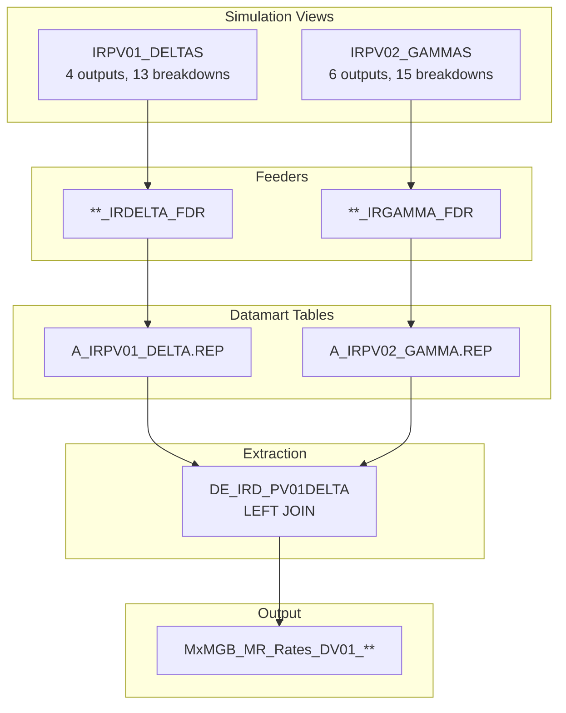
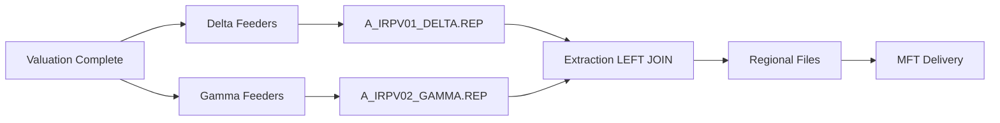

---
# Document Metadata
document_id: IR-OVW-001
document_name: IR Delta & Gamma - Overview
version: 1.0
effective_date: 2025-01-03
next_review_date: 2026-01-03
owner: Market Risk Technology
approving_committee: Risk Technology Change Board

# Taxonomy Reference
parent_node: L7-Systems/market-risk/feeds
feed_family: IR Delta & Gamma
---

# IR Delta & Gamma - Overview

**Meridian Global Bank - Market Risk Technology**

| Document Control | |
|-----------------|---|
| **Document ID** | IR-OVW-001 |
| **Version** | 1.0 |
| **Effective Date** | 3 January 2025 |
| **Owner** | Market Risk Technology |
| **Approver** | Risk Technology Change Board |

---

## 1. Introduction

### 1.1 Purpose

This document provides an overview of the IR Delta & Gamma feed suite from Murex to downstream risk systems. It serves as the parent document for the IR sensitivity feed documentation, describing the overall architecture, data flow, and relationships between components.

### 1.2 Scope

The IR Delta & Gamma suite provides interest rate risk exposures and their associated sensitivities for **interest rate risk factors** arising from IRD trading activity executed in Murex. Like Energy Sensitivities, IR Delta & Gamma uses a **single combined feed** approach where Delta and Gamma sensitivities are merged during the extraction process via a LEFT JOIN.

### 1.3 Feed Family Overview

| Property | Value |
|----------|-------|
| **Feed Family** | IR Delta & Gamma |
| **Number of Feeds** | 1 (combined Delta + Gamma) |
| **Source System** | Murex (VESPA Module) |
| **Target Systems** | Risk Data Warehouse, Plato, VESPA Reporting |
| **Frequency** | Daily (T+1) |
| **Regions** | London (LN), Hong Kong (HK), New York (NY), Singapore (SP) |

---

## 2. Feed Architecture

### 2.1 Single Feed Structure

The IR Delta & Gamma feed combines two simulation views into a single output via LEFT JOIN:

```
IR Delta & Gamma Feed
├── Delta Component (from IRPV01_DELTAS)
│   ├── DV01 (Zero) - Zero coupon curve sensitivity
│   └── DV01 USD - USD equivalent sensitivity
└── Gamma Component (from IRPV02_GAMMAS)
    ├── Gamma Zero CCY - Local currency gamma
    └── Gamma Zero USD - USD equivalent gamma
```

### 2.2 Output Feed

| Feed Name | File Pattern | Description |
|-----------|--------------|-------------|
| IR Delta & Gamma | `MxMGB_MR_Rates_DV01_{Region}_{YYYYMMDD}.csv` | Combined Delta and Gamma sensitivities |

### 2.3 Data Flow Architecture



---

## 3. Simulation Views

### 3.1 IRPV01_DELTAS

The Delta simulation view calculates interest rate DV01 sensitivities (dollar value of a 1 basis point shift).

| Property | Value |
|----------|-------|
| **View Name** | IRPV01_DELTAS |
| **Outputs** | 4 |
| **Breakdowns** | 13 |
| **Dynamic Table** | VW_IRPV01_DELTA |
| **Datamart Table** | A_IRPV01_DELTA.REP |

#### Outputs

| Output | Dictionary Path | Description |
|--------|-----------------|-------------|
| DV01 (zero) | RiskEngine.Results.Outputs.Interest rates.Delta.Zero.Value | IR Delta per 1bp parallel shift (local CCY) |
| DV01 USD | RiskEngine.Results.Outputs.Interest rates.Delta.Zero.Value USD | IR Delta in USD equivalent |
| DV01 ZAR | (Deprecated) | ZAR equivalent - SBSA exclusion |
| DV01 Par ZAR | (Deprecated) | Par ZAR equivalent - SBSA exclusion |

#### Key Breakdowns

| Breakdown | Dictionary Path | Description |
|-----------|-----------------|-------------|
| Curve name | RiskEngine.Results.Outputs.Interest rates.Delta.Zero.Curve key.Curve name | Interest rate curve label |
| Date | RiskEngine.Results.Outputs.Interest rates.Delta.Zero.Date | Pillar date from maturity set |
| M_TRN_FMLY | Data.Trade.Typology.Family | Trade family (IRD, etc.) |
| M_TRN_GRP | Data.Trade.Typology.Group | Trade group |
| M_TRN_TYPE | Data.Trade.Typology.Type | Trade type |
| M_TP_PFOLIO | Data.Trade.Portfolio | Trading portfolio |

### 3.2 IRPV02_GAMMAS

The Gamma simulation view calculates the rate of change of Delta for a 1bp shift (convexity measure).

| Property | Value |
|----------|-------|
| **View Name** | IRPV02_GAMMAS |
| **Outputs** | 6 |
| **Breakdowns** | 15 |
| **Dynamic Table** | VW_IRPV02_GAMMA |
| **Datamart Table** | A_IRPV02_GAMMA.REP |

#### Outputs

| Output | Dictionary Path | Description |
|--------|-----------------|-------------|
| Gamma Zero CCY | RiskEngine.Results.Outputs.Interest rates.Gamma.Zero.Value | Gamma in local currency |
| Gamma Zero USD | RiskEngine.Results.Outputs.Interest rates.Gamma.Zero.Value USD | Gamma in USD equivalent |
| Gamma Zero ZAR | (Deprecated) | ZAR equivalent - SBSA exclusion |
| Gamma Par CCY | RiskEngine.Results.Outputs.Interest rates.Gamma.Par.Value | Par gamma in local currency |
| Gamma Par USD | RiskEngine.Results.Outputs.Interest rates.Gamma.Par.Value USD | Par gamma in USD equivalent |
| Gamma Par ZAR | (Deprecated) | Par ZAR equivalent - SBSA exclusion |

#### Key Breakdowns

| Breakdown | Dictionary Path | Description |
|-----------|-----------------|-------------|
| Curve name | RiskEngine.Results.Outputs.Interest rates.Gamma.Zero.Curve key.Curve name | Interest rate curve label |
| Date | RiskEngine.Results.Outputs.Interest rates.Gamma.Zero.Date | Pillar date from maturity set |
| M_TRN_FMLY | Data.Trade.Typology.Family | Trade family |
| M_TRN_GRP | Data.Trade.Typology.Group | Trade group |
| M_TRN_TYPE | Data.Trade.Typology.Type | Trade type |

#### Maturity Set: LNOFFICIAL

Both simulation views use maturity set LNOFFICIAL with pillars:
- O/N, T/N, 1W, 2W
- 1M, 2M, 3M, 6M, 9M
- 1Y, 2Y, 3Y, 5Y, 7Y, 10Y, 15Y, 20Y, 30Y

---

## 4. Product Scope

### 4.1 IRD Product Types

The IR Delta & Gamma feed covers the following Family/Group/Type combinations:

| Family | Group | Type | Description | Has Gamma |
|--------|-------|------|-------------|-----------|
| IRD | CF | * | Caps and Floors | Yes |
| IRD | OSWP | * | Swaptions | Yes |
| IRD | SWAP | * | Interest Rate Swaps | No |
| IRD | FRA | * | Forward Rate Agreements | No |
| IRD | FUT | * | Interest Rate Futures | No |
| IRD | BOND | * | Bonds | No |
| IRD | REPO | * | Repurchase Agreements | No |

### 4.2 Gamma Product Filtering

Gamma values are only calculated for products with optionality:

| Product | Gamma Calculation | Rationale |
|---------|-------------------|-----------|
| **IRD\|CF\|** (Caps/Floors) | Yes | Option premium sensitivity to rate changes |
| **IRD\|OSWP\|** (Swaptions) | Yes | Option premium sensitivity to rate changes |
| All other IRD products | No (Gamma = 0) | Linear products have no convexity |

### 4.3 Purged Deal Handling

For purged deals (historical trades no longer in live system):
- Delta: Calculated from archived data
- Gamma: Set to 0 (not recalculated)

---

## 5. Regional Processing

### 5.1 Market Data Sets

| Region | Market Data Set | Close Time |
|--------|-----------------|------------|
| London (LN) | MGB_LN_EOD | GMT close |
| Hong Kong (HK) | MGB_HK_EOD | HKT close |
| New York (NY) | MGB_NY_EOD | EST close |
| Singapore (SP) | MGB_SP_EOD | SGT close |

### 5.2 Portfolio Nodes by Region

#### Delta Feeders

| Region | Portfolio Nodes | Notes |
|--------|-----------------|-------|
| HK | IRDLN, IRDHK | Standard batch |
| LN | IRDLN (3 batches) | Legacy split for performance |
| NY | IRDNY | Standard batch |
| SP | IRDSP | Standard batch |

**Note**: London region uses 3 separate feeder batches for historical performance reasons.

#### Gamma Feeders

| Region | Portfolio Nodes | Gamma Filter |
|--------|-----------------|--------------|
| HK | IRDLN, IRDHK | IRD\|CF\|, IRD\|OSWP\| only |
| LN | IRDLN | IRD\|CF\|, IRD\|OSWP\| only |
| NY | IRDNY | IRD\|CF\|, IRD\|OSWP\| only |
| SP | IRDSP | IRD\|CF\|, IRD\|OSWP\| only |

---

## 6. Special Handling

### 6.1 ZAR Processing (Deprecated)

The following ZAR-related fields were originally included for SBSA (Standard Bank South Africa) but are now deprecated:

| Field | Status | Reason |
|-------|--------|--------|
| DV01 ZAR | Deprecated | SBSA exclusion |
| DV01 Par ZAR | Deprecated | SBSA exclusion |
| Gamma Zero ZAR | Deprecated | SBSA exclusion |
| Gamma Par ZAR | Deprecated | SBSA exclusion |

These fields remain in the output structure for backward compatibility but are no longer populated.

### 6.2 Delta-Gamma Join Logic

The extraction combines Delta and Gamma using a LEFT JOIN:

```sql
SELECT
    d.TRADE_NUM,
    d.PORTFOLIO,
    d.DATE,
    d.CURVENAME,
    d.TYPOLOGY,
    d.DELTAUSD,
    COALESCE(g.GAMMAUSD, 0) as GAMMAUSD
FROM A_IRPV01_DELTA.REP d
LEFT JOIN A_IRPV02_GAMMA.REP g
    ON d.TRADE_NUM = g.TRADE_NUM
    AND d.CURVENAME = g.CURVENAME
    AND d.DATE = g.DATE
```

This ensures all Delta records are included, with Gamma defaulting to 0 for products without optionality.

### 6.3 Curve Name Standardization

Interest rate curve names follow the pattern: `{CCY}_{INDEX}_{TENOR}`

| Example | Description |
|---------|-------------|
| USD_LIBOR_3M | USD 3-month LIBOR curve |
| EUR_EURIBOR_6M | EUR 6-month EURIBOR curve |
| GBP_SONIA | GBP SONIA overnight curve |
| USD_SOFR | USD SOFR overnight curve |

---

## 7. Output Structure

### 7.1 Output Fields (17 Fields)

| # | Field | Type | Length | Description |
|---|-------|------|--------|-------------|
| 1 | TRADE_NUM | VarChar | 20 | Trade number |
| 2 | PORTFOLIO | VarChar | 30 | Trading portfolio |
| 3 | DATE | Date | - | Pillar date |
| 4 | CURVENAME | VarChar | 50 | Interest rate curve name |
| 5 | TYPOLOGY | VarChar | 30 | Product typology (Family\|Group\|Type) |
| 6 | FAMILY | VarChar | 10 | Trade family |
| 7 | GROUP | VarChar | 10 | Trade group |
| 8 | TYPE | VarChar | 10 | Trade type |
| 9 | CATEGORY | VarChar | 20 | Trade category |
| 10 | ISSUE | VarChar | 50 | Issue identifier |
| 11 | PROFITCENTRE | VarChar | 20 | Profit centre |
| 12 | DELTAUSD | Numeric | 18,4 | DV01 in USD |
| 13 | GAMMAUSD | Numeric | 18,4 | Gamma in USD |
| 14 | ZAR_PROCESSING | VarChar | 1 | (Deprecated) |
| 15 | DELTAZAR | Numeric | 18,4 | (Deprecated) |
| 16 | GAMMAZAR | Numeric | 18,4 | (Deprecated) |
| 17 | PARDELTAZAR | Numeric | 18,4 | (Deprecated) |
| 18 | PARGAMMAZAR | Numeric | 18,4 | (Deprecated) |

### 7.2 Active vs Deprecated Fields

| Field Category | Fields | Status |
|----------------|--------|--------|
| **Trade Identification** | TRADE_NUM, PORTFOLIO, TYPOLOGY, FAMILY, GROUP, TYPE | Active |
| **Risk Factor** | DATE, CURVENAME | Active |
| **USD Sensitivities** | DELTAUSD, GAMMAUSD | Active |
| **ZAR Sensitivities** | ZAR_PROCESSING, DELTAZAR, GAMMAZAR, PARDELTAZAR, PARGAMMAZAR | Deprecated |

---

## 8. Processing Schedule

### 8.1 Daily Timeline (GMT)

| Time | Event |
|------|-------|
| 18:00 | Market data close (LN) |
| 21:00 | Valuation batch complete |
| 02:00 | Delta feeder batch start |
| 02:30 | Gamma feeder batch start |
| 03:00 | Delta feeder batch complete |
| 03:30 | Gamma feeder batch complete |
| 04:00 | Extraction batch start (LEFT JOIN) |
| 04:30 | Extraction complete |
| 05:00 | File delivery via MFT |

### 8.2 Processing Flow



---

## 9. Feed Documentation Index

| Document | ID | Description |
|----------|-----|-------------|
| [IR Delta & Gamma BRD](./ir-delta-gamma-brd.md) | IR-BRD-001 | Business requirements |
| [IR Delta & Gamma IT Config](./ir-delta-gamma-config.md) | IR-CFG-001 | Murex GOM configuration |
| [IR Delta & Gamma IDD](./ir-delta-gamma-idd.md) | IR-IDD-001 | Interface design |

---

## 10. Comparison with Other Sensitivity Feeds

| Aspect | IR Delta & Gamma | Energy | Credit |
|--------|------------------|--------|--------|
| Number of Feeds | 1 | 1 | 8 |
| Structure | Combined (LEFT JOIN) | Combined (UNION) | Separate feeds |
| Delta Sensitivity | DV01 (Zero) | Commodity Delta | CS01 (Zero/Par) |
| Gamma Sensitivity | IR Gamma | Commodity Gamma | N/A |
| Vega Sensitivity | N/A | Commodity Vega | N/A |
| Theta Sensitivity | N/A | Commodity Theta | N/A |
| Rho Sensitivity | N/A | DV01×100 | N/A |
| File Prefix | MxMGB_MR_Rates_DV01 | MxMGB_MR_Energy_Sens | MxMGB_MR_Credit_* |

---

## 11. Related Documents

| Document | ID | Relationship |
|----------|-----|-------------|
| [Feeds Overview](../feeds-overview.md) | MR-L7-003 | Parent document |
| [Data Dictionary](../../data-dictionary.md) | MR-L7-002 | Field definitions |
| [Energy Sensitivities Overview](../energy-sensitivities/energy-sensitivities-overview.md) | EN-OVW-001 | Related suite |
| [CR Sensitivities Overview](../cr-sensitivities/cr-sensitivities-overview.md) | CR-OVW-001 | Related suite |

---

## 12. Document Control

### 12.1 Version History

| Version | Date | Change | Author |
|---------|------|--------|--------|
| 1.0 | 2025-01-03 | Initial version | Risk Technology |

### 12.2 Approval

| Role | Name | Date |
|------|------|------|
| Business Owner | Head of Rates Trading | |
| Technical Owner | Head of Risk Technology | |
| Approver | Risk Technology Change Board | |

---

*End of Document*
