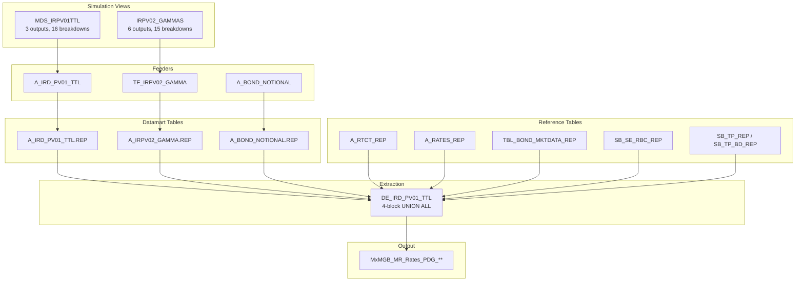

---
# Document Metadata
document_id: PDG-OVW-001
document_name: IR Par Delta Gamma (PDG) - Overview
version: 1.0
effective_date: 2025-01-03
next_review_date: 2026-01-03
owner: Product Control
approving_committee: Risk Technology Change Board

# Taxonomy Reference
parent_node: L7-Systems/market-risk/feeds
feed_family: IR Par Delta Gamma
---

# IR Par Delta Gamma (PDG) - Overview

**Meridian Global Bank - Market Risk Technology**

| Document Control | |
|-----------------|---|
| **Document ID** | PDG-OVW-001 |
| **Version** | 1.0 |
| **Effective Date** | 3 January 2025 |
| **Owner** | Product Control |
| **Approver** | Risk Technology Change Board |

---

## 1. Introduction

### 1.1 Purpose

This document provides an overview of the IR Par Delta Gamma (PDG) sensitivity feed from Murex to downstream systems. It serves as the parent document for the IR PDG feed documentation, describing the overall architecture, data flow, and relationships between components.

### 1.2 Scope

The IR PDG feed provides market risk exposures and their associated **par rate sensitivities** for IR risk factors arising from any trading activity executed in Murex. Unlike the Market Risk IR Delta & Gamma feed (which uses zero rate sensitivities), this feed uses par yield curve sensitivities specifically for Product Control requirements.

**Important Note**: This feed is requested by **Product Control**, not Market Risk. The same Gamma simulation view (IRPV02_GAMMAS) produces both zero rate and par rate sensitivities - the PDG feed extracts only par rate outputs, while the Market Risk IR Delta feed extracts zero rate outputs.

### 1.3 Feed Family Overview

| Property | Value |
|----------|-------|
| **Feed Family** | IR Par Delta Gamma (PDG) |
| **Number of Feeds** | 1 |
| **Source System** | Murex (VESPA Module) |
| **Target Systems** | Risk Data Warehouse, Plato |
| **Frequency** | Daily (T+1) |
| **Regions** | London (LN), Hong Kong (HK), New York (NY), Sao Paulo (SP) |
| **Business Owner** | Product Control |

---

## 2. Feed Architecture

### 2.1 Dual Simulation View Structure

The IR PDG feed combines outputs from two simulation views:

```
IR Par Delta Gamma Feed
├── IR Delta (Par Rate) Component
│   └── MDS_IRPV01TTL
│       ├── DV01(par) - Local currency
│       ├── DV01(par) - USD equivalent
│       └── DV01(par) - ZAR equivalent (deprecated)
│
└── IR Gamma (Par Rate) Component
    └── IRPV02_GAMMAS
        ├── Gamma Par CCY - Local currency
        ├── Gamma Par USD - USD equivalent
        └── Gamma Par ZAR - ZAR equivalent (deprecated)
```

### 2.2 Output Feed

| Feed Name | File Pattern | Description |
|-----------|--------------|-------------|
| IR Par Delta Gamma | `MxMGB_MR_Rates_PDG_{Region}_{YYYYMMDD}.csv` | IR par rate delta and gamma sensitivities |

### 2.3 Data Flow Architecture



---

## 3. Key Differences: Par Rate vs Zero Rate Sensitivities

### 3.1 Sensitivity Type Comparison

| Aspect | Par Rate (PDG Feed) | Zero Rate (Market Risk Feed) |
|--------|---------------------|------------------------------|
| **Curve Bumped** | Par yield curve | Zero coupon curve |
| **Consumer** | Product Control | Market Risk |
| **Simulation View (Delta)** | MDS_IRPV01TTL | IRPV01_DELTAS |
| **Simulation View (Gamma)** | IRPV02_GAMMAS (PAR outputs) | IRPV02_GAMMAS (ZERO outputs) |
| **Use Case** | P&L attribution, front office | Risk limits, regulatory capital |
| **File Prefix** | MxMGB_MR_Rates_PDG | MxMGB_MR_Rates_DV01 |

### 3.2 Understanding Par Rate Sensitivity

Par rate sensitivity (DV01 par) measures the change in value with respect to a parallel shift in the **par yield curve** by 1 basis point. This is the sensitivity to quoted market rates (e.g., swap rates) rather than derived zero rates.

| Metric | Description |
|--------|-------------|
| **DV01(par)** | Change in NPV per 1bp parallel shift in par yield curve |
| **Gamma(par)** | Second derivative - convexity with respect to par rates |

---

## 4. Simulation Views

### 4.1 MDS_IRPV01TTL (IR Delta Par)

| Property | Value |
|----------|-------|
| **View Name** | MDS_IRPV01TTL |
| **Outputs** | 3 |
| **Breakdowns** | 16 |
| **Dynamic Table** | A_IRD_IRPV01_TTL |
| **Datamart Table** | A_IRD_PV01_TTL.REP |

#### Outputs

| Output | Dictionary Path | Description |
|--------|-----------------|-------------|
| DV01(par) | RiskEngine.Results.Outputs.Interest rates.Delta.Par.Value | IR Delta Par in native currency |
| DV01(par) USD | RiskEngine.Results.Outputs.Interest rates.Delta.Par.Value | IR Delta Par in USD (zero day FX) |
| DV01(par) ZAR | RiskEngine.Results.Outputs.Interest rates.Delta.Par.Value | IR Delta Par in ZAR (Deprecated) |

#### Key Breakdowns

| Breakdown | Dictionary Path | Description |
|-----------|-----------------|-------------|
| Date | RiskEngine.Results.Outputs.Interest rates.Delta.Par.Date | Pillar date from LNOFFICIAL |
| Curve Name | RiskEngine.Results.Outputs.Interest rates.Delta.Par.Curve key.Curve name | Interest rate curve label |
| Currency | RiskEngine.Results.Outputs.Interest rates.Delta.Par.Curve key.Currency | Curve currency |
| Portfolio | Data.Trade.Portfolio | Trading portfolio |
| Trade Number | Data.Trade.Trade number | Unique trade identifier |
| Family | Data.Trade.Family | Product family |
| Group | Data.Trade.Group | Product group |
| Type | Data.Trade.Type | Product type |
| Sec Code | Data.Trade.Sec code | Security code |
| PL Instrument | Data.Trade.PL Instrument | P&L instrument |
| Typology | Data.Trade.Typology | Product classification |

### 4.2 IRPV02_GAMMAS (IR Gamma Par)

| Property | Value |
|----------|-------|
| **View Name** | IRPV02_GAMMAS |
| **Outputs** | 6 (3 Zero + 3 Par) |
| **Breakdowns** | 15 |
| **Dynamic Table** | A_IRPV02_GAMMA |
| **Datamart Table** | A_IRPV02_GAMMA.REP |

**Note**: This view produces both zero rate and par rate gamma. The PDG extraction selects only the par rate outputs (GAMMA_PAR_CCY, GAMMA_PAR_USD, GAMMA_PAR_ZAR).

#### Par Rate Outputs (Used in PDG)

| Output | Description |
|--------|-------------|
| GAMMA_PAR_CCY | IR Gamma Par in native currency |
| GAMMA_PAR_USD | IR Gamma Par in USD |
| GAMMA_PAR_ZAR | IR Gamma Par in ZAR (Deprecated) |

---

## 5. Complex Processing Features

### 5.1 Structured Bond (STB) Handling

The PDG extraction uses a 4-block UNION ALL SQL structure to handle Structured Bond trades:

| Block | Description | Condition |
|-------|-------------|-----------|
| 1 | Non-dummy STB bonds | Rate generator = -1 (M_GENINTNB) |
| 2 | Non-dummy STB bonds | Rate generator ≠ -1 |
| 3 | Dummy STB bonds | Rate generator = -1 |
| 4 | Dummy STB bonds | Rate generator ≠ -1 |

**Dummy bonds** are underlying bonds used in Structured Bond deals, identified in `SB_SE_RBC_REP`.

### 5.2 Bond Notional Lookups

For bond trades (TRN_GRP="BOND"), the feed fetches notional amounts from `A_BOND_NOTIONAL.REP`:

| Field | Source | Description |
|-------|--------|-------------|
| act. Notional | M_TP_RTCCP02 | Bond notional |
| Evaluation(Bond) | TBL_BOND_MKTDATA_REP | Bond evaluation mode |

### 5.3 Curve Enrichment

The extraction joins to reference tables for curve metadata:

| Table | Purpose |
|-------|---------|
| A_RTCT_REP | Curve type and generator information |
| A_RATES_REP | Rate definition, convexity spread flags |
| TBL_BOND_MKTDATA_REP | Bond market data and evaluation mode |
| SB_SE_RBC_REP | Risk Basket Composition for structured products |
| SB_TP_REP / SB_TP_BD_REP | Trade parameters for bonds |

---

## 6. Product Scope

### 6.1 IR-Sensitive Products

The IR PDG feed covers all trades with IR sensitivity:

| Family | Group | Type | Description |
|--------|-------|------|-------------|
| IRD | SWAP | * | Interest Rate Swaps |
| IRD | CF | * | Caps/Floors (Gamma only) |
| IRD | OSWP | * | Swaptions (Gamma only) |
| IRD | FRA | * | Forward Rate Agreements |
| FXD | CS | * | Cross-Currency Swaps |
| COM | * | * | Commodities with IR exposure |
| BOND | * | * | Bonds with IR sensitivity |

### 6.2 Product Filtering

| Filter Type | Description |
|-------------|-------------|
| **Gamma Products** | IRD\|CF\| (Caps/Floors) and IRD\|OSWP\| (Swaptions) |
| **Bond Handling** | Separate feeder for A_BOND_NOTIONAL.REP |
| **Non-Zero Filter** | DV01__PA1<>0.OR.DV01__PAR<>0 |

---

## 7. Regional Processing

### 7.1 Market Data Sets

| Region | Market Data Set | Description |
|--------|-----------------|-------------|
| London (LN) | LNCLOSE | London EOD market data |
| Hong Kong (HK) | HKCLOSE | Hong Kong EOD market data |
| New York (NY) | NYCLOSE | New York EOD market data |
| Sao Paulo (SP) | SPCLOSE | Sao Paulo EOD market data |

### 7.2 Portfolio Nodes by Region

| Region | Level 4 Portfolio Nodes |
|--------|-------------------------|
| LDN | FXDLN, IRLN, LMLN, PMLN |
| HKG | LMHK, PMSG |
| NYK | LMNY, PMNY |
| SAO | LMSP |

**Note**: Some feeders select Level 5 nodes that are the only children of Level 4 nodes (e.g., LMLNSBL is selected but LMLN could be used as it only contains LMLNSBL).

---

## 8. Special Handling

### 8.1 HKG Expression Filter

The HKG feeder includes an expression filter to exclude certain cross-currency swaps:

```
.NOT.(TRN_GRP="CS".AND.(INSTRUMENT="SGD/USD F/F 6M".OR.INSTRUMENT="SGD/USD F/V 3M".OR.INSTRUMENT="SGD/USD V/V 6M"))
```

### 8.2 Deprecated Fields

| Field | Status | Reason |
|-------|--------|--------|
| DV01(par) ZAR | Deprecated | SBSA exclusion |
| GAMMA_PAR_ZAR | Deprecated | SBSA exclusion |
| ZAR_PROCESSING | Deprecated | JBSBSA closing entity flag |

### 8.3 Spread Flags

| Field | Source | Logic |
|-------|--------|-------|
| Curve_Spread | A_RTCT_REP.M_BID_S | Y if spread exists, N if null or group is future |
| Convexity_Spread | A_RATES_REP.M_S_BID1 | Y if convexity spread exists, N otherwise |

---

## 9. Output Structure

### 9.1 Output Fields (26 Fields)

| # | Field | Type | Length | Description |
|---|-------|------|--------|-------------|
| 1 | PORTFOLIO | VarChar | 16 | Trading portfolio |
| 2 | Family | VarChar | 16 | Product family |
| 3 | Group | VarChar | 5 | Product group |
| 4 | Type | VarChar | 16 | Product type |
| 5 | Instrument | VarChar | 50 | P&L instrument |
| 6 | Sec_code | VarChar | 16 | Security code |
| 7 | Trade Number | Numeric | 16 | Trade identifier (0 if DEAD) |
| 8 | CURRENCY | VarChar | 4 | Curve currency |
| 9 | CURVE_NAM | VarChar | 35 | Rate curve name |
| 10 | CurveType | VarChar | 10 | Curve type (from A_RTCT_REP) |
| 11 | Generat | VarChar | 10 | Generator name |
| 12 | DATE | VarChar | 64 | Pillar date |
| 13 | Delta Par | American | 16,2 | IR Delta Par (local CCY) |
| 14 | Delta Par(USD) | American | 16,2 | IR Delta Par in USD |
| 15 | Gamma Par | American | 16,2 | IR Gamma Par (local CCY) |
| 16 | Gamma Par(USD) | American | 16,2 | IR Gamma Par in USD |
| 17 | act. Notional | American | 25,8 | Bond notional amount |
| 18 | Evaluation(Bond) | VarChar | - | Bond evaluation mode |
| 19 | ZAR_PROCESSING | VarChar | 1 | ZAR flag (Y/N) - Deprecated |
| 20 | Delta Par(ZAR) | American | 12,2 | IR Delta Par in ZAR - Deprecated |
| 21 | Gamma Par(ZAR) | American | 16,2 | IR Gamma Par in ZAR - Deprecated |
| 22 | Typology | VarChar | 21 | Product typology |
| 23 | Curve_Spread | VarChar | 1 | Spread flag (Y/N) |
| 24 | Convexity_Spread | VarChar | 1 | Convexity spread flag (Y/N) |
| 25 | RBC_FMLY | VarChar | - | Risk Basket Family (blank) |
| 26 | RBC_GRP | VarChar | - | Risk Basket Group (blank) |
| 27 | RBC_TYPE | VarChar | - | Risk Basket Type (blank) |
| 28 | RBC_INSTRUMENT | VarChar | - | Risk Basket Instrument (blank) |

**Note**: RBC fields are placeholders set to blank at extraction level.

---

## 10. Processing Schedule

### 10.1 Daily Timeline (GMT)

| Time | Event |
|------|-------|
| 18:00 | Market data close (LN) |
| 21:00 | Valuation batch complete |
| 02:00 | IR Delta feeders start |
| 02:30 | IR Gamma feeders start |
| 03:30 | Feeder batches complete |
| 04:00 | Extraction batch start |
| 04:30 | Extraction complete |
| 05:00 | File packaging (process_reports.sh) |
| 05:30 | MFT delivery |

---

## 11. Feed Documentation Index

| Document | ID | Description |
|----------|-----|-------------|
| [IR PDG BRD](./ir-pdg-brd.md) | PDG-BRD-001 | Business requirements |
| [IR PDG IT Config](./ir-pdg-config.md) | PDG-CFG-001 | Murex GOM configuration |
| [IR PDG IDD](./ir-pdg-idd.md) | PDG-IDD-001 | Interface design |

---

## 12. Comparison with Other IR Sensitivity Feeds

| Aspect | IR PDG | IR Delta & Gamma | IR Zero Basis |
|--------|--------|------------------|---------------|
| **Risk Type** | Par rate sensitivity | Zero rate sensitivity | Basis spread |
| **Consumer** | Product Control | Market Risk | Market Risk |
| **Delta View** | MDS_IRPV01TTL | IRPV01_DELTAS | MDS_BASISSWAP |
| **Gamma View** | IRPV02_GAMMAS (PAR) | IRPV02_GAMMAS (ZERO) | N/A |
| **Outputs** | 6 (3 Delta + 3 Gamma) | 10 (4 Delta + 6 Gamma) | 3 |
| **Maturity Set** | LNOFFICIAL (to 30Y) | LNOFFICIAL (to 30Y) | RISK_VIEW (to 40Y) |
| **Bond Handling** | Yes (complex STB logic) | No | No |
| **Output Fields** | 26 | 12 | 12 |

---

## 13. Related Documents

| Document | ID | Relationship |
|----------|-----|-------------|
| [Feeds Overview](../feeds-overview.md) | MR-L7-003 | Parent document |
| [Data Dictionary](../../data-dictionary.md) | MR-L7-002 | Field definitions |
| [IR Delta & Gamma Overview](../ir-delta-gamma/ir-delta-gamma-overview.md) | IR-OVW-001 | Related zero rate feed |
| [IR Zero Basis Overview](../ir-zero-basis/ir-zero-basis-overview.md) | IRB-OVW-001 | Related basis feed |

---

## 14. Document Control

### 14.1 Version History

| Version | Date | Change | Author |
|---------|------|--------|--------|
| 1.0 | 2025-01-03 | Initial version | Risk Technology |

### 14.2 Approval

| Role | Name | Date |
|------|------|------|
| Business Owner | Head of Product Control | |
| Technical Owner | Head of Risk Technology | |
| Approver | Risk Technology Change Board | |

---

*End of Document*
