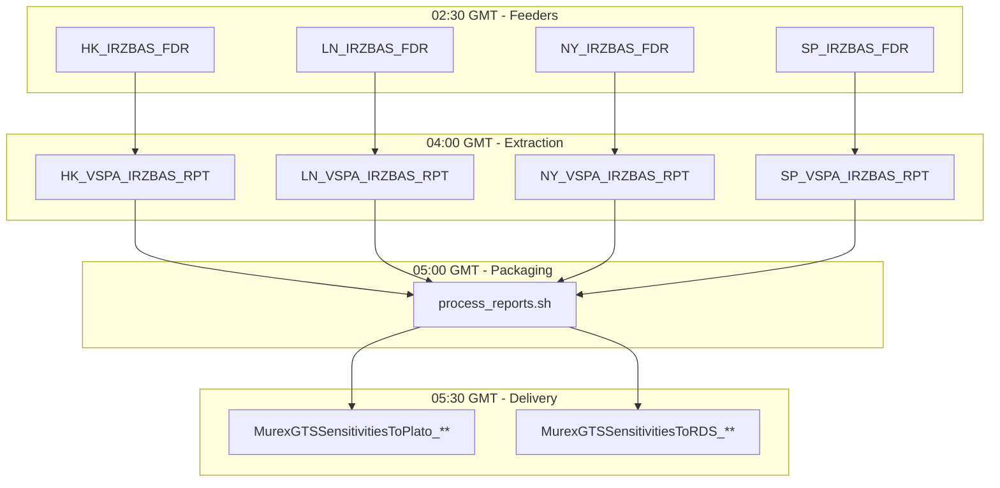

---
# Document Metadata
document_id: IRB-CFG-001
document_name: IR Zero Basis - IT Configuration
version: 1.0
effective_date: 2025-01-03
next_review_date: 2026-01-03
owner: Market Risk Technology
approving_committee: Risk Technology Change Board

# Taxonomy Reference
parent_node: L7-Systems/market-risk/feeds/ir-zero-basis
feed_family: IR Zero Basis
document_type: Config
---

# IR Zero Basis - IT Configuration

**Meridian Global Bank - Market Risk Technology**

| Document Control | |
|-----------------|---|
| **Document ID** | IRB-CFG-001 |
| **Version** | 1.0 |
| **Effective Date** | 3 January 2025 |
| **Owner** | Market Risk Technology |
| **Approver** | Risk Technology Change Board |

---

## 1. Introduction

### 1.1 Purpose

This document details the Murex GOM (Generic Object Management) configuration for the IR Zero Basis sensitivity feed. It provides the technical specifications required to configure, maintain, and troubleshoot the feed components within Murex.

### 1.2 Scope

This configuration covers:
- Simulation View definition (MDS_BASISSWAP)
- Feeder configurations per region
- Datamart table structure
- Data Extractor configuration with JOINs
- Extraction Request setup
- Regional processing parameters

---

## 2. Component Overview

### 2.1 Architecture Diagram

```
┌─────────────────────────────────────────────────────────────────────────────┐
│                          IR ZERO BASIS FEED                                 │
├─────────────────────────────────────────────────────────────────────────────┤
│                                                                             │
│             ┌──────────────────────────────┐                                │
│             │   Processing Script Feeder   │                                │
│             │   **_IRZBAS_FDR              │                                │
│             └──────────────┬───────────────┘                                │
│                            │                                                │
│                            ▼                                                │
│             ┌──────────────────────────────┐                                │
│             │   Feeder                     │                                │
│             │   A_BASISSWAP                │                                │
│             └──────────────┬───────────────┘                                │
│                            │                                                │
│      ┌─────────────────────┼─────────────────────┐                          │
│      │                     │                     │                          │
│      ▼                     ▼                     ▼                          │
│ ┌──────────────┐   ┌──────────────────┐   ┌──────────────────┐              │
│ │ Simulation   │   │ Datamart Table   │   │ Extraction       │              │
│ │ View         │──▶│ A_IRBASISSWAP    │──▶│ BASISSWP_FRM_ZAR │              │
│ │ MDS_BASISSWAP│   │ .REP             │   │                  │              │
│ └──────────────┘   └──────────────────┘   └────────┬─────────┘              │
│                                                    │                        │
│      ┌─────────────────────┬───────────────────────┤                        │
│      │                     │                       │                        │
│      ▼                     ▼                       ▼                        │
│ ┌──────────────┐   ┌──────────────────┐   ┌──────────────────┐              │
│ │ A_CURVENAME  │   │ A_RTCT_REP       │   │ Processing Script│              │
│ │ _REP         │   │ (Curve Config)   │   │ **_DE_IR_BASISSWAP              │
│ └──────────────┘   └──────────────────┘   └────────┬─────────┘              │
│                                                    │                        │
│                                                    ▼                        │
│                            ┌──────────────────────────────┐                 │
│                            │   Feed                       │                 │
│                            │   MxMGB_MR_Rates_Basis_**    │                 │
│                            │   _yyyymmdd.csv              │                 │
│                            └──────────────────────────────┘                 │
│                                                                             │
└─────────────────────────────────────────────────────────────────────────────┘
```

### 2.2 Component Summary

| Component Type | Name | Description |
|---------------|------|-------------|
| Simulation View | MDS_BASISSWAP | Basis sensitivity calculation |
| Feeder | A_BASISSWAP | Populates datamart table |
| Datamart Table | A_IRBASISSWAP.REP | Basis results storage |
| Dynamic Table | A_BASISSWAP | Runtime calculation table |
| Reference Table | A_CURVENAME_REP | Curve name mapping |
| Reference Table | A_RTCT_REP | Rate curve configuration |
| Extraction | BASISSWP_FRM_ZAR | SQL extraction with JOINs |
| Data Extractor | DE_IRD_PV01DELTA | Shared extractor |
| Extraction Request | IRPV01_Delta_ZAR | Shared request |

---

## 3. Simulation View

### 3.1 MDS_BASISSWAP

#### 3.1.1 View Properties

| Property | Value |
|----------|-------|
| **View Name** | MDS_BASISSWAP |
| **View Type** | Dynamic |
| **Dynamic Table** | A_BASISSWAP |
| **Datamart Table** | A_IRBASISSWAP.REP |
| **Calculation Engine** | Standard Valuation |

#### 3.1.2 Outputs Configuration

| # | Output Name | Dictionary Path | Type | Precision |
|---|-------------|-----------------|------|-----------|
| 1 | Basis (zero) | RiskEngine.Results.Outputs.Interest rates.Basis.Zero.Value | Numeric | 6 |
| 2 | Basis (zero) ZAR | RiskEngine.Results.Outputs.Interest rates.Basis.Zero.Value | Numeric | 6 |
| 3 | Basis (zero) USD | RiskEngine.Results.Outputs.Interest rates.Basis.Zero.Value | Numeric | 6 |

**Note**: Output 2 (ZAR) is deprecated but retained for backward compatibility.

#### 3.1.3 Breakdowns Configuration

| # | Breakdown Name | Dictionary Path | Type |
|---|----------------|-----------------|------|
| 1 | Portfolio | Data.Trade.Portfolio | String |
| 2 | Closing Entity | Data.Trade.Closing entity | String |
| 3 | Legal Entity | Data.Trade.Legal entity | String |
| 4 | Trade Number | Data.Trade.Trade number | Numeric |
| 5 | Family | Data.Trade.Typology.Family | String |
| 6 | Group | Data.Trade.Typology.Group | String |
| 7 | Type | Data.Trade.Typology.Type | String |
| 8 | Curve name | RiskEngine.Results.Outputs.Interest rates.Basis.Zero.Curve key.Curve name | String |
| 9 | Currency | RiskEngine.Results.Outputs.Interest rates.Delta.Zero.Curve key.Currency | String |
| 10 | Date | RiskEngine.Results.Outputs.Interest rates.Basis.Zero.Date | Date |
| 11 | Typology | Data.Trade.Typology | String |

#### 3.1.4 Maturity Set Configuration

| Property | Value |
|----------|-------|
| **Maturity Set Name** | RISK_VIEW |
| **Reference Output** | Interest rates.Basis.Zero |
| **Mat. Source** | Maturity Set |
| **Bucket Type** | Pillars |
| **Display Mode** | Label |
| **Split Mode** | Surrounding pillars |
| **Reduced Label** | Yes |
| **Standard Labels** | Yes |

**Pillar Definition:**

| Tenor | Label | Tenor | Label |
|-------|-------|-------|-------|
| O/N | O/N | 6Y | 6Y |
| T/N | T/N | 7Y | 7Y |
| 1W | 1W | 8Y | 8Y |
| 1M | 1M | 9Y | 9Y |
| 2M | 2M | 10Y | 10Y |
| 3M | 3M | 12Y | 12Y |
| 6M | 6M | 15Y | 15Y |
| 9M | 9M | 20Y | 20Y |
| 1Y | 1Y | 25Y | 25Y |
| 2Y | 2Y | 30Y | 30Y |
| 3Y | 3Y | 35Y | 35Y |
| 4Y | 4Y | 40Y | 40Y |
| 5Y | 5Y | | |

---

## 4. Feeders

### 4.1 Feeder Configuration by Region

| Region | Processing Script | Batches of Feeders | Global Filter | Feeder |
|--------|-------------------|-------------------|---------------|--------|
| HKG | HK_IRZBAS_FDR | B_IRBASISSWPHKG | B_IRDPV01OHKG | A_BASISSWAP |
| LDN | LN_IRZBAS_FDR | B_IRBASISSWPLDN | B_IRDPV01OLDN_JB | A_BASISSWAP |
| NYK | NY_IRZBAS_FDR | B_IRBASISSWPNYK | B_IRDPV01ONYK | A_BASISSWAP |
| SAO | SP_IRZBAS_FDR | B_IRBASISSWPSAO | B_IRDPV01OSAO | A_BASISSWAP |

### 4.2 Portfolio Nodes by Region

#### HKG Portfolio Nodes

| Node | Description |
|------|-------------|
| FXHKSBL | FX Hong Kong |
| HKSBSA | HK SBSA |
| LMHKSBL | LM Hong Kong |
| LMHKSGACU | LM HK SG ACU |
| LMHKSGDBU | LM HK SG DBU |
| PMSG | PM Singapore |

#### LDN Portfolio Nodes

| Node | Description |
|------|-------------|
| FXDLNSBL | FXD London |
| FXLNSBL | FX London |
| IFXMMLNIC | IFX MM London IC |
| IFXMMLNLH | IFX MM London LH |
| IRLNSBL | IR London |
| JBSBSA | JB SBSA (inactive) |
| LMLNSBL | LM London |
| LNSBSA | LN SBSA |
| MMLNSBLTRADT1 | MM London Trade T1 |
| MMLNSBLTRADT2 | MM London Trade T2 |
| MMLNSBLTRADT3 | MM London Trade T3 |
| MMLNSBLTRADT4 | MM London Trade T4 |
| PMLN | PM London |

#### NYK Portfolio Nodes

| Node | Description |
|------|-------------|
| FXNYSBL | FX New York |
| FXNYSBLSPROPOP1 | FX NY SP ROP 1 |
| FXNYSBLSPROPOP2 | FX NY SP ROP 2 |
| LMNYSBL | LM New York |
| LMNYSBLEM1 | LM NY EM 1 |
| LMNYSBLEMT1 | LM NY EM T1 |
| LMNYSBLSO | LM NY SO |
| NYSBSA | NY SBSA |
| PMNY | PM New York |

#### SAO Portfolio Nodes

| Node | Description |
|------|-------------|
| CTBASBLARCTG | CT BA CTG |
| CTBASBLARLON | CT BA LON |
| CTSPSBLSTRUCT | CT SP Struct |
| LMBASBLARCTI | LM BA CTI |
| LMBASBLARSWP | LM BA SWP |
| LMBASBLFXMIRR | LM BA FX MIRR |
| LMBASBLFXTRD | LM BA FX TRD |
| LMSPBSI | LM SP BSI |
| LMSPFIA | LM SP FIA |
| LMSPFND | LM SP FND |
| LMSPSBL | LM SP |
| LMSPSBLCAPITAL | LM SP Capital |
| LMSPSBLCUPOM | LM SP CUPOM |
| LMSPSBLFXOPT | LM SP FX Opt |
| LMSPSBLSO | LM SP SO |

### 4.3 Global Filter Notes

#### HKG Special Filter

The HKG global filter (B_IRDPV01OHKG) includes an expression filter:

```
NOT.(TRN_GRP="CS".AND.(INSTRUMENT="SGD/USD F/F 6M".OR.INSTRUMENT="SGD/USD F/V 3M".OR.INSTRUMENT="SGD/USD V/V 6M"))
```

**Purpose**: Excludes specific SGD/USD currency swaps
**Status**: Related deals have long expired - recommend removal

### 4.4 Feeder Parameters

| Parameter | Value | Description |
|-----------|-------|-------------|
| Mode | REPLACE | Full refresh each run |
| Target Table | A_IRBASISSWAP.REP | Datamart table |
| Simulation View | MDS_BASISSWAP | Source view |
| Dynamic Table | A_BASISSWAP | Runtime table |
| Batch Size | 5000 | Records per commit |
| Timeout | 1800 | Seconds |

### 4.5 Market Data Sets

| Region | Market Data Set | Description |
|--------|-----------------|-------------|
| HKG | HKCLOSE | Hong Kong close |
| LDN | LNCLOSE | London close |
| NYK | NYCLOSE | New York close |
| SAO | SPCLOSE | Sao Paulo close |

---

## 5. Datamart Table

### 5.1 A_IRBASISSWAP.REP

#### 5.1.1 Table Structure

| # | Column | Type | Length | Nullable | Description |
|---|--------|------|--------|----------|-------------|
| 1 | M_PORTFOLIO | VARCHAR | 16 | NO | Trading portfolio |
| 2 | M_CLOSING_E | VARCHAR | 20 | YES | Closing entity |
| 3 | M_LEGAL_ENT | VARCHAR | 20 | YES | Legal entity |
| 4 | M_TRADE_NUM | NUMBER | 16 | NO | Trade number |
| 5 | M_TRN_FMLY | VARCHAR | 10 | YES | Trade family |
| 6 | M_TRN_GRP | VARCHAR | 10 | YES | Trade group |
| 7 | M_TRN_TYPE | VARCHAR | 10 | YES | Trade type |
| 8 | M_CURVE_NAM | VARCHAR | 50 | NO | Curve name |
| 9 | M_CURRENCY | VARCHAR | 4 | NO | Currency |
| 10 | M_DATE | VARCHAR | 64 | NO | Pillar date |
| 11 | M_TYPOLOGY | VARCHAR | 21 | YES | Typology |
| 12 | M_BASIS__ZE | NUMBER | 16,6 | YES | Basis Zero (local) |
| 13 | M_BASIS__Z1 | NUMBER | 16,6 | YES | Basis Zero ZAR |
| 14 | M_BASIS__Z2 | NUMBER | 16,6 | YES | Basis Zero USD |
| 15 | M_REF_DATA | VARCHAR | 20 | NO | Reference data set |
| 16 | M_TIMESTAMP | TIMESTAMP | - | NO | Record timestamp |

#### 5.1.2 Indexes

| Index Name | Columns | Type |
|------------|---------|------|
| PK_IRBASISSWAP | M_TRADE_NUM, M_CURVE_NAM, M_DATE, M_REF_DATA | Primary Key |
| IX_IRBASIS_PFOLIO | M_PORTFOLIO | Non-unique |
| IX_IRBASIS_CURVE | M_CURVE_NAM | Non-unique |

---

## 6. Reference Tables

### 6.1 A_CURVENAME_REP

Maps curve display labels to internal curve names.

| Column | Description |
|--------|-------------|
| M_DLABEL | Display label (matches M_CURVE_NAM) |
| M_LABEL | Internal curve label |
| M_REF_DATA | Reference data set |

### 6.2 A_RTCT_REP

Rate curve configuration table providing generator details.

| Column | Description |
|--------|-------------|
| M_D_CURVE | Curve name (JOIN key) |
| M_D_CUR | Currency (JOIN key) |
| M_LABEL_D | Pillar date (JOIN key) |
| M_TYPE | Generator type (e.g., "Basis swap") |
| M_GENINTNB | Generator internal number |
| M_GENERAT | Generator name (if M_GENINTNB = -1) |
| M_D_GEN | Generator name (otherwise) |
| M_REF_DATA | Reference data set |

---

## 7. Data Extraction

### 7.1 Extraction Configuration

| Region | Processing Script | Batches of Extraction | Data Extractor | Extraction Request |
|--------|-------------------|----------------------|----------------|-------------------|
| HKG | HK_VSPA_IRZBAS_RPT | BE_IRD_BSSWAPHK | DE_IRD_PV01DELTA | IRPV01_Delta_ZAR |
| LDN | LN_VSPA_IRZBAS_RPT | BE_IRD_BSSWAPLD | DE_IRD_PV01DELTA | IRPV01_Delta_ZAR |
| NYK | NY_VSPA_IRZBAS_RPT | BE_IRD_BSSWAPNY | DE_IRD_PV01DELTA | IRPV01_Delta_ZAR |
| SAO | SP_VSPA_IRZBAS_RPT | BE_IRD_BSSWAPSP | DE_IRD_PV01DELTA | IRPV01_Delta_ZAR |

### 7.2 SQL Extraction Query

```sql
SELECT
    A_IRBASISSWAP.M_PORTFOLIO AS M_PORTFOLIO,
    A_IRBASISSWAP.M_TRADE_NUM,
    A_IRBASISSWAP.M_CURRENCY AS M_CURRENCY,
    M_CURVE_NAM AS M_CURVE_NAM,
    A_RTCT.M_TYPE AS D_TYPE,
    (CASE WHEN A_RTCT.M_GENINTNB = -1
          THEN A_RTCT.M_GENERAT
          ELSE A_RTCT.M_D_GEN
     END) AS M_D_GEN,
    M_DATE AS M_DATE,
    A_IRBASISSWAP.M_BASIS__ZE,
    CASE WHEN A_IRBASISSWAP.M_CLOSING_E = 'JBSBSA'
         THEN 'Y'
         ELSE 'N'
    END AS ZAR_PROCESSING,
    A_IRBASISSWAP.M_BASIS__Z2 AS BASIS__Z_USD,
    A_IRBASISSWAP.M_BASIS__Z1 AS BASIS__Z_ZAR,
    A_IRBASISSWAP.M_TYPOLOGY AS TYPOLOGY
FROM DM.A_IRBASISSWAP_REP A_IRBASISSWAP
LEFT OUTER JOIN DM.A_CURVENAME_REP A_CUR
    ON UPPER(A_IRBASISSWAP.M_CURVE_NAM) = UPPER(A_CUR.M_DLABEL)
    AND A_IRBASISSWAP.M_REF_DATA = A_CUR.M_REF_DATA
LEFT OUTER JOIN DM.A_RTCT_REP A_RTCT
    ON (UPPER(A_CUR.M_LABEL) = UPPER(A_RTCT.M_D_CURVE))
    AND (A_IRBASISSWAP.M_CURRENCY = A_RTCT.M_D_CUR
    AND A_IRBASISSWAP.M_DATE = A_RTCT.M_LABEL_D
    AND A_IRBASISSWAP.M_REF_DATA = A_RTCT.M_REF_DATA)
WHERE
    A_IRBASISSWAP.M_REF_DATA = @MxDataSetKey:N
    AND (A_IRBASISSWAP.M_BASIS__Z1 <> 0
         OR A_IRBASISSWAP.M_BASIS__ZE <> 0)
    AND @MxSQLExpression:C
ORDER BY A_IRBASISSWAP.M_TRADE_NUM
```

### 7.3 SQL Logic Explanation

| Step | Description |
|------|-------------|
| 1 | Fetch trade and sensitivity data from A_IRBASISSWAP_REP |
| 2 | LEFT JOIN to A_CURVENAME_REP to map display label to internal label |
| 3 | LEFT JOIN to A_RTCT_REP to fetch generator type and name |
| 4 | Filter to exclude zero sensitivities |
| 5 | Apply @MxSQLExpression:C filter (excludes SBSA: M_LEGAL_ENT<>'SBSA') |
| 6 | Order by trade number |

### 7.4 Generator Name Logic

```sql
CASE WHEN A_RTCT.M_GENINTNB = -1
     THEN A_RTCT.M_GENERAT
     ELSE A_RTCT.M_D_GEN
END AS M_D_GEN
```

- If M_GENINTNB = -1: Use M_GENERAT field
- Otherwise: Use M_D_GEN field

---

## 8. Output File Configuration

### 8.1 File Properties

| Property | Value |
|----------|-------|
| **File Pattern** | MxMGB_MR_Rates_Basis_{Region}_{YYYYMMDD}.csv |
| **Output Directory** | ./reports/today/eod |
| **Delimiter** | Semicolon (;) |
| **Encoding** | UTF-8 |
| **Header Row** | Yes |

### 8.2 Post-Processing

A script (`process_reports.sh`) packages the IR Basis file along with other market risk reports into:

```
MxMGB_MR_Sensitivities_{Region}_{YYYYMMDD}.zip
```

---

## 9. Regional Batch Flow

### 9.1 Processing Sequence



### 9.2 Timeout Configuration

| Component | Timeout (seconds) | Alert Threshold |
|-----------|-------------------|-----------------|
| Feeder | 1800 | 1350 (75%) |
| Extraction | 1200 | 900 (75%) |
| Packaging | 600 | 450 (75%) |

---

## 10. Delivery Configuration

### 10.1 MFT Configuration

| Target | MFT ID Pattern | Description |
|--------|----------------|-------------|
| Plato | MurexGTSSensitivitiesToPlato_{Region} | Risk reporting platform |
| RDS | MurexGTSSensitivitiesToRDS_{Region} | Risk data store |

### 10.2 Regional MFT IDs

| Region | Plato MFT ID | RDS MFT ID |
|--------|--------------|------------|
| LN | MurexGTSSensitivitiesToPlato_LN | MurexGTSSensitivitiesToRDS_LN |
| HK | MurexGTSSensitivitiesToPlato_HK | MurexGTSSensitivitiesToRDS_HK |
| NY | MurexGTSSensitivitiesToPlato_NY | MurexGTSSensitivitiesToRDS_NY |
| SP | MurexGTSSensitivitiesToPlato_SP | MurexGTSSensitivitiesToRDS_SP |

---

## 11. Error Handling

### 11.1 Feeder Errors

| Error Type | Action | Notification |
|------------|--------|--------------|
| Connection failure | Retry 3 times | Alert after 3rd failure |
| Timeout | Abort and alert | Immediate |
| Data validation | Log and continue | Daily summary |

### 11.2 Extraction Errors

| Error Type | Action | Notification |
|------------|--------|--------------|
| Source table empty | Abort | Immediate |
| JOIN failures | Continue with NULLs | Warning |
| File write failure | Retry | Alert after 3rd failure |

---

## 12. Document Control

### 12.1 Version History

| Version | Date | Change | Author |
|---------|------|--------|--------|
| 1.0 | 2025-01-03 | Initial version | Risk Technology |

### 12.2 Approval

| Role | Name | Date |
|------|------|------|
| Technical Owner | Murex Support Lead | |
| Data Owner | Risk Technology Lead | |
| Approver | Risk Technology Change Board | |

---

*End of Document*
