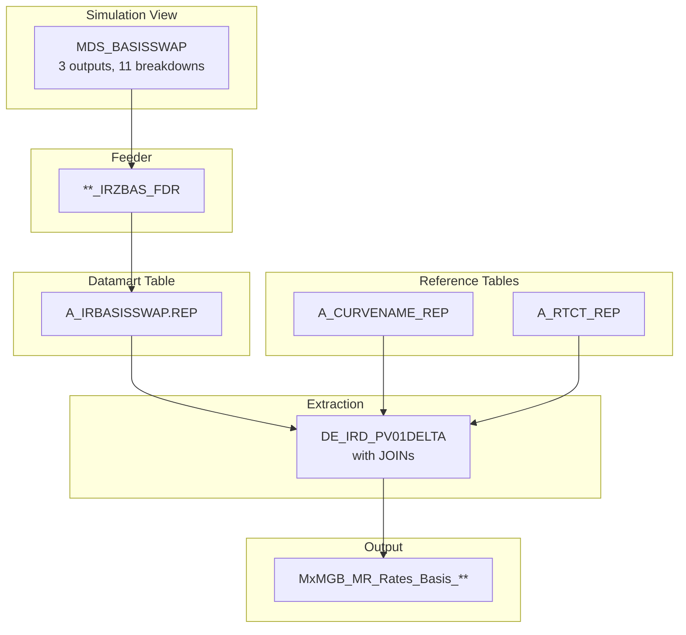
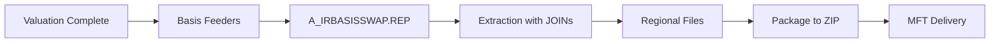

---
# Document Metadata
document_id: IRB-OVW-001
document_name: IR Zero Basis - Overview
version: 1.0
effective_date: 2025-01-03
next_review_date: 2026-01-03
owner: Market Risk Technology
approving_committee: Risk Technology Change Board

# Taxonomy Reference
parent_node: L7-Systems/market-risk/feeds
feed_family: IR Zero Basis
---

# IR Zero Basis - Overview

**Meridian Global Bank - Market Risk Technology**

| Document Control | |
|-----------------|---|
| **Document ID** | IRB-OVW-001 |
| **Version** | 1.0 |
| **Effective Date** | 3 January 2025 |
| **Owner** | Market Risk Technology |
| **Approver** | Risk Technology Change Board |

---

## 1. Introduction

### 1.1 Purpose

This document provides an overview of the IR Zero Basis sensitivity feed from Murex to downstream risk systems. It serves as the parent document for the IR basis risk feed documentation, describing the overall architecture, data flow, and relationships between components.

### 1.2 Scope

The IR Zero Basis feed provides market risk exposures and their associated sensitivities for **IR basis risk** - the variation arising from two interest rate curves in the same currency but using different fixing regimes. This risk arises from basis swaps and cross-currency basis positions where the spread between two indices can move independently.

### 1.3 Feed Family Overview

| Property | Value |
|----------|-------|
| **Feed Family** | IR Zero Basis |
| **Number of Feeds** | 1 |
| **Source System** | Murex (VESPA Module) |
| **Target Systems** | Risk Data Warehouse, Plato, VESPA Reporting |
| **Frequency** | Daily (T+1) |
| **Regions** | London (LN), Hong Kong (HK), New York (NY), Sao Paulo (SP) |

---

## 2. Feed Architecture

### 2.1 Single Feed Structure

The IR Zero Basis feed captures basis swap sensitivities using a single simulation view:

```
IR Zero Basis Feed
└── Basis Component (from MDS_BASISSWAP)
    ├── Basis (zero) - Local currency sensitivity
    ├── Basis (zero) USD - USD equivalent sensitivity
    └── Basis (zero) ZAR - ZAR equivalent (deprecated)
```

### 2.2 Output Feed

| Feed Name | File Pattern | Description |
|-----------|--------------|-------------|
| IR Zero Basis | `MxMGB_MR_Rates_Basis_{Region}_{YYYYMMDD}.csv` | IR basis swap sensitivities |

### 2.3 Data Flow Architecture



---

## 3. Simulation View

### 3.1 MDS_BASISSWAP

The basis swap simulation view calculates IR basis sensitivities by bumping zero coupon curves.

| Property | Value |
|----------|-------|
| **View Name** | MDS_BASISSWAP |
| **Outputs** | 3 |
| **Breakdowns** | 11 |
| **Dynamic Table** | A_BASISSWAP |
| **Datamart Table** | A_IRBASISSWAP.REP |

#### Outputs

| Output | Dictionary Path | Description |
|--------|-----------------|-------------|
| Basis (zero) | RiskEngine.Results.Outputs.Interest rates.Basis.Zero.Value | IR Basis Zero in local currency. Sensitivity of NPV to zero rates variation for Basis Curves |
| Basis (zero) USD | RiskEngine.Results.Outputs.Interest rates.Basis.Zero.Value | IR Basis Zero in USD. Uses zero day FX spot for conversion |
| Basis (zero) ZAR | RiskEngine.Results.Outputs.Interest rates.Basis.Zero.Value | IR Basis Zero in ZAR (Deprecated - SBSA exclusion) |

#### Key Breakdowns

| Breakdown | Dictionary Path | Description |
|-----------|-----------------|-------------|
| Date | RiskEngine.Results.Outputs.Interest rates.Basis.Zero.Date | Pillar date from maturity set RISK_VIEW |
| Curve Name | RiskEngine.Results.Outputs.Interest rates.Basis.Zero.Curve key.Curve name | Interest rate curve label for which sensitivity is calculated |
| Currency | RiskEngine.Results.Outputs.Interest rates.Delta.Zero.Curve key.Currency | Currency of the interest rate curve |
| Portfolio | Data.Trade.Portfolio | Trading portfolio |
| Trade Number | Data.Trade.Trade number | Unique trade identifier |
| Legal Entity | Data.Trade.Legal entity | Legal entity code |
| Closing Entity | Data.Trade.Closing entity | Closing entity (used for ZAR flag) |
| Typology | Data.Trade.Typology | Product classification |

#### Maturity Set: RISK_VIEW

The Basis calculation uses maturity set RISK_VIEW with an extended pillar set:

| Tenor Category | Pillars |
|---------------|---------|
| Short-term | O/N, T/N, 1W |
| Money Market | 1M, 2M, 3M, 6M, 9M |
| Swap Tenors | 1Y, 2Y, 3Y, 4Y, 5Y, 6Y, 7Y, 8Y, 9Y, 10Y, 12Y, 15Y, 20Y, 25Y, 30Y, 35Y, 40Y |

**Note**: This maturity set extends to 40Y, longer than the standard LNOFFICIAL set used for IR Delta & Gamma.

---

## 4. Understanding Basis Risk

### 4.1 What is Basis Risk?

Basis risk arises when a portfolio is exposed to the **spread between two different interest rate indices** in the same currency. Unlike outright IR risk (DV01), basis risk measures sensitivity to changes in this spread.

### 4.2 Common Basis Risk Sources

| Basis Type | Example | Description |
|------------|---------|-------------|
| **Tenor Basis** | 3M LIBOR vs 6M LIBOR | Spread between different tenors of same index |
| **Index Basis** | LIBOR vs OIS | Spread between different indices |
| **Cross-Currency Basis** | EUR/USD 3M | Spread between funding in different currencies |
| **RFR Transition Basis** | LIBOR vs SOFR | Spread during benchmark transition |

### 4.3 Example Basis Curves

| Curve Name | Description |
|------------|-------------|
| EUR_USD_3MESTR_3MSOFR | EUR ESTR 3M vs USD SOFR 3M basis |
| GBP_USD_3MSONIA_3MSOFR | GBP SONIA 3M vs USD SOFR 3M basis |
| USD_3MLIBOR_SOFR | USD 3M LIBOR vs SOFR basis (legacy) |

---

## 5. Product Scope

### 5.1 Products with Basis Risk

The IR Zero Basis feed covers trades that are sensitive to basis spread movements:

| Family | Group | Type | Description |
|--------|-------|------|-------------|
| IRD | BS | * | Basis Swaps |
| IRD | CCS | * | Cross-Currency Swaps |
| IRD | SWAP | * | Interest Rate Swaps (multi-curve) |
| FXD | CS | * | Currency Swaps |

### 5.2 Basis Risk Characteristics

| Characteristic | Description |
|----------------|-------------|
| **Risk Driver** | Spread between two IR curves |
| **Hedging** | Basis swaps, cross-currency basis swaps |
| **Correlation** | Generally low correlation to outright IR |
| **Liquidity** | Less liquid than outright IR markets |

---

## 6. Regional Processing

### 6.1 Market Data Sets

| Region | Market Data Set | Description |
|--------|-----------------|-------------|
| London (LN) | LNCLOSE | London EOD market data |
| Hong Kong (HK) | HKCLOSE | Hong Kong EOD market data |
| New York (NY) | NYCLOSE | New York EOD market data |
| Sao Paulo (SP) | SPCLOSE | Sao Paulo EOD market data |

### 6.2 Portfolio Nodes by Region

| Region | Key Portfolio Nodes |
|--------|---------------------|
| HKG | FXHKSBL, HKSBSA, LMHKSBL, LMHKSGACU, LMHKSGDBU, PMSG |
| LDN | FXDLNSBL, FXLNSBL, IFXMMLNIC, IFXMMLNLH, IRLNSBL, JBSBSA, LMLNSBL, LNSBSA, MMLNSBLTRADT1-4, PMLN |
| NYK | FXNYSBL, FXNYSBLSPROPOP1-2, LMNYSBL, LMNYSBLEM1, LMNYSBLEMT1, LMNYSBLSO, NYSBSA, PMNY |
| SAO | CTBASBLAR*, CTSPSBL*, LMBASBL*, LMSPBSI, LMSPFIA, LMSPFND, LMSPSBL*, PMSP |

**Note**: Portfolio filtering noted as requiring cleanup - some inactive portfolios included, some active portfolios missing.

---

## 7. Special Handling

### 7.1 ZAR Processing (Deprecated)

| Field | Status | Reason |
|-------|--------|--------|
| Basis (zero) ZAR | Deprecated | SBSA exclusion |
| ZAR_PROCESSING flag | Deprecated | Based on JBSBSA closing entity |

### 7.2 Curve Enrichment

The extraction joins to reference tables for curve metadata:

| Table | Purpose |
|-------|---------|
| A_CURVENAME_REP | Maps curve display labels to internal names |
| A_RTCT_REP | Provides generator type and generator name per pillar |

### 7.3 Generator Information

The feed includes rate curve generator details:

| Field | Source | Description |
|-------|--------|-------------|
| Type | A_RTCT.M_TYPE | Generator type at curve level (e.g., "Basis swap") |
| Generat | A_RTCT.M_D_GEN | Generator name (e.g., "_EUR ESTR 3M /USD SOFR 3M") |

---

## 8. Output Structure

### 8.1 Output Fields (12 Fields)

| # | Field | Type | Length | Description |
|---|-------|------|--------|-------------|
| 1 | PORTFOLIO | VarChar | 16 | Trading portfolio |
| 2 | Trade Number | Numeric | 16 | Trade identifier |
| 3 | CURRENCY | VarChar | 4 | Basis curve currency |
| 4 | CURVE_NAM | VarChar | 50 | Interest rate curve name |
| 5 | Type | VarChar | 10 | Generator type |
| 6 | Generat | VarChar | 15 | Generator name |
| 7 | DATE | VarChar | 64 | Pillar date |
| 8 | Basis Zero | Numeric | 16,6 | IR Basis Zero (local CCY) |
| 9 | ZAR_PROCESSING | VarChar | 1 | JBSBSA flag (deprecated) |
| 10 | Basis Zero (USD) | Numeric | 16,6 | IR Basis Zero in USD |
| 11 | Basis Zero (ZAR) | Numeric | 16,6 | IR Basis Zero in ZAR (deprecated) |
| 12 | Typology | VarChar | 21 | Product typology |

---

## 9. Processing Schedule

### 9.1 Daily Timeline (GMT)

| Time | Event |
|------|-------|
| 18:00 | Market data close (LN) |
| 21:00 | Valuation batch complete |
| 02:30 | Basis feeder batch start |
| 03:30 | Basis feeder batch complete |
| 04:00 | Extraction batch start |
| 04:30 | Extraction complete |
| 05:00 | File packaging (process_reports.sh) |
| 05:30 | MFT delivery |

### 9.2 Processing Flow



---

## 10. Feed Documentation Index

| Document | ID | Description |
|----------|-----|-------------|
| [IR Zero Basis BRD](./ir-zero-basis-brd.md) | IRB-BRD-001 | Business requirements |
| [IR Zero Basis IT Config](./ir-zero-basis-config.md) | IRB-CFG-001 | Murex GOM configuration |
| [IR Zero Basis IDD](./ir-zero-basis-idd.md) | IRB-IDD-001 | Interface design |

---

## 11. Comparison with Other IR Sensitivity Feeds

| Aspect | IR Zero Basis | IR Delta & Gamma | Credit CS01 |
|--------|---------------|------------------|-------------|
| Risk Type | Basis spread | Outright IR | Credit spread |
| Simulation View | MDS_BASISSWAP | IRPV01_DELTAS, IRPV02_GAMMAS | CR_CS01_* |
| Outputs | 3 | 4 + 6 | 2 |
| Maturity Set | RISK_VIEW (to 40Y) | LNOFFICIAL (to 30Y) | PILLARS (to 30Y) |
| Convexity (Gamma) | No | Yes | No |
| File Prefix | MxMGB_MR_Rates_Basis | MxMGB_MR_Rates_DV01 | MxMGB_MR_Credit_* |

---

## 12. Related Documents

| Document | ID | Relationship |
|----------|-----|-------------|
| [Feeds Overview](../feeds-overview.md) | MR-L7-003 | Parent document |
| [Data Dictionary](../../data-dictionary.md) | MR-L7-002 | Field definitions |
| [IR Delta & Gamma Overview](../ir-delta-gamma/ir-delta-gamma-overview.md) | IR-OVW-001 | Related IR feed |
| [Energy Sensitivities Overview](../energy-sensitivities/energy-sensitivities-overview.md) | EN-OVW-001 | Related suite |

---

## 13. Document Control

### 13.1 Version History

| Version | Date | Change | Author |
|---------|------|--------|--------|
| 1.0 | 2025-01-03 | Initial version | Risk Technology |

### 13.2 Approval

| Role | Name | Date |
|------|------|------|
| Business Owner | Head of Rates Trading | |
| Technical Owner | Head of Risk Technology | |
| Approver | Risk Technology Change Board | |

---

*End of Document*
